## 
基于网格的NM不等式约束优化算法[1]总结报告

侯力广 521070910043

 

#### 
1.引言

&emsp;&emsp;在黑盒优化问题中：Nelder-Mead(NM)算法是一种处理无约束优化问题的算法，通过不断替换单纯性中最差的点来实现下降，但无法保证算法的收敛性；网格自适应方向搜索(Mads)算法是一种常用于处理不等式约束优化问题的算法，该方法有严谨的收敛性证明。在文献[1]中，作者将NM算法与Mads算法进行融合，提出的Mads-NM算法不仅可以解决不等式约束优化问题，具备严谨的收敛性证明，而且相较于NM和Mads均有明显的数值效果提升。

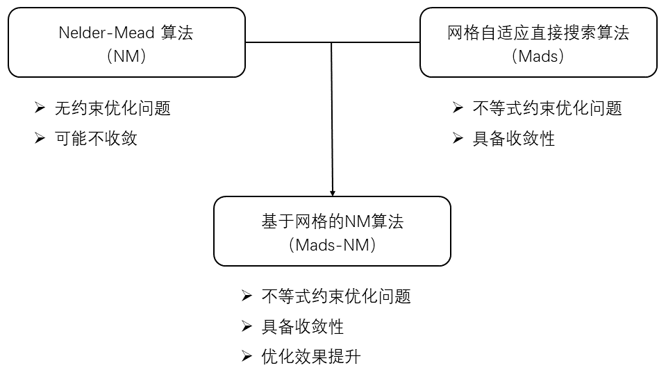

 
&emsp;&emsp;本次报告将分为四部分：NM无约束优化算法、Mads不等式约束优化算法、Mads-NM不等式约束优化算法，以及三种方法的效果比较。
 
 

#### 
2.NM无约束优化算法

##### 2.1 目标问题

&emsp;&emsp;考虑无约束优化问题
$$\begin{equation*}
\underset{x\in\mathrm{R}^n}{\mathrm{min} } f(x)
\end{equation*}$$

&emsp;&emsp;其中$f:\mathbb{R}^n\mapsto\mathbb{R}$为目标函数。

##### 2.2 整体思路

&emsp;&emsp;NM算法于1965年被首次提出，其核心思路是：初始化一个有序单纯形并进行迭代，每一步迭代都要用一个更好的点来替换当前单纯形的最差点【详见2.4-NM-1】。随着迭代次数的增加，单纯形会变得越来越好，单纯形的最优点可能会收敛到目标问题的最优解【详见2.4-NM-2】。当迭代满足一定条件（例如相邻两次迭代的最优点函数值之差小于某个容忍值）时，迭代停止，将最终得到的单纯形的最优点作为目标问题的最优解。

##### 2.3 基本概念

&emsp;&emsp;$\spadesuit$ **定义2.1 (控制)：** $x,y\in\mathbb{R}^n$，若$f(x)<f(y)$，称$x$控制$y$，记作$x \prec y$.

&emsp;&emsp;$\spadesuit$ **定义2.2 (更旧)：** 若算法中$x$在$y$之前生成，则称$x$比$y$旧。定义函数$\operatorname{Older}:\mathbb{R}^n\times\mathbb{R}^n\longmapsto\mathbb{R}$
$$ \operatorname{Older}(x, y)=\left\{\begin{array}{ll}
      x & \text {若 } x \text { 在 } y \text { 之前生成}\\
      y & \text {其他 }
      \end{array}\right.$$

&emsp;&emsp;&emsp;$\operatorname{Older}(x,y)$会输出$x,y$中更旧的那个。

&emsp;&emsp;$\spadesuit$ **定义2.3 (更好)：** 定义函数$\operatorname{Best}:\mathbb{R}^n\times\mathbb{R}^n\longmapsto\mathbb{R}^n$
$$\operatorname{Best}(x, y)=\left\{\begin{array}{cl}
      x & \text {若 } x \prec  y \\
      y & \text {若 } y \prec  x \\
      \operatorname{Older}(x, y) & \text {若 } f(x)=f(y)
      \end{array}\right.$$

&emsp;&emsp;&emsp;易证$\operatorname{Best}$具有传递性。若$x=\operatorname{Best}(x,y)$，则称$x$比$y$更好。

&emsp;&emsp;$\spadesuit$ **定义2.4 (有序单纯形)：** 将$\mathbb{R}^n$中$n+1$个仿射无关的点排序为$y^0,y^1,\cdots y^n$，使得$y^{i-1} \prec y^i (i=1,2,\cdots,n)$，则集合$$\mathbb{Y}=\{y^0,y^1,\cdots,y^n\}$$

&emsp;&emsp;&emsp;称为一个有序单纯形。

&emsp;&emsp;$\spadesuit$ **定义2.5 (区域)：** 记$\mathbb{Y}=\{y^0,y^1,\cdots,y^n\}$为$\mathbb{R}^n$上的有一个有序单纯形，测试点$x\in\mathbb{R}^n$

&emsp;&emsp;&emsp;$\bullet$ 若$y^n\prec x$，则$x$属于内缩区域；
&emsp;&emsp;&emsp;$\bullet$ 其余情况，若$x\prec y^0$，则$x$属于扩张区域；
&emsp;&emsp;&emsp;$\bullet$ 其余情况，若$x$至少掌控了$\mathbb{Y}$中的两个点，则$x$属于反射区域；
&emsp;&emsp;&emsp;$\bullet$ 其余情况，即$x$掌控了$\mathbb{Y}$中的零或一个点，则$x$属于外缩区域。

&emsp;&emsp;$\spadesuit$ **注释Ⅰ：** 定义2.1-2.5仅针对无约束优化的目标问题2.1，对于不等式约束优化的目标问题3.1和4.1，我们会在下文给出新的定义。

##### 2.4 算法细节

&emsp;&emsp;$\clubsuit$ **NM-1. 替换最差点的原则**

&emsp;&emsp;NM算法的每一步迭代都会将有序单纯形$\mathbb{Y}$中最差的点$y^n$替换为一个更好的点。现做定义如下：

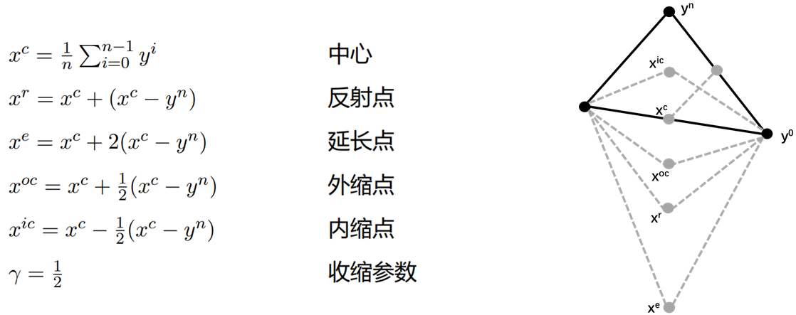

 

&emsp;&emsp;每一步迭代有五种替换方案，要么用$x^{r},x^{e},x^{oc},x^{ic}$中的一个点替换$y^{n}$，要么将$y^1,y^2,\cdots,y^n$向$y^0$的方向收缩，即：
$$\begin{equation}\mathbb{Y}\longleftarrow\{y^0,y^0+\gamma(y^1-y^0),\cdots,y^0+\gamma(y^n-y^0)\}.\end{equation}$$

&emsp;&emsp;针对不同的情况，NM会选取不同的替换点：

&emsp;&emsp;&emsp;&emsp;$\bullet$ 若$x^r$属于内缩区域且$x^{ic}$属于内缩区域，用公式(1)收缩；
&emsp;&emsp;&emsp;&emsp;$\bullet$ 若$x^r$属于内缩区域且$x^{ic}$不属于内缩区域，用$x^{ic}$替换$y^{n}$；
&emsp;&emsp;&emsp;&emsp;$\bullet$ 除上述情况，若$x^r$属于扩张区域，用$\operatorname{Best}(x^r,x^e)$替换$y^{n}$；
&emsp;&emsp;&emsp;&emsp;$\bullet$ 除上述情况，若$x^r$属于反射区域，用$x^{r}$替换$y^{n}$；
&emsp;&emsp;&emsp;&emsp;$\bullet$ 除上述情况，即$x^r$属于外缩区域，用$\operatorname{Best}(x^r,x^{oc})$替换$y^{n}$；

&emsp;&emsp;NM算法流程图：

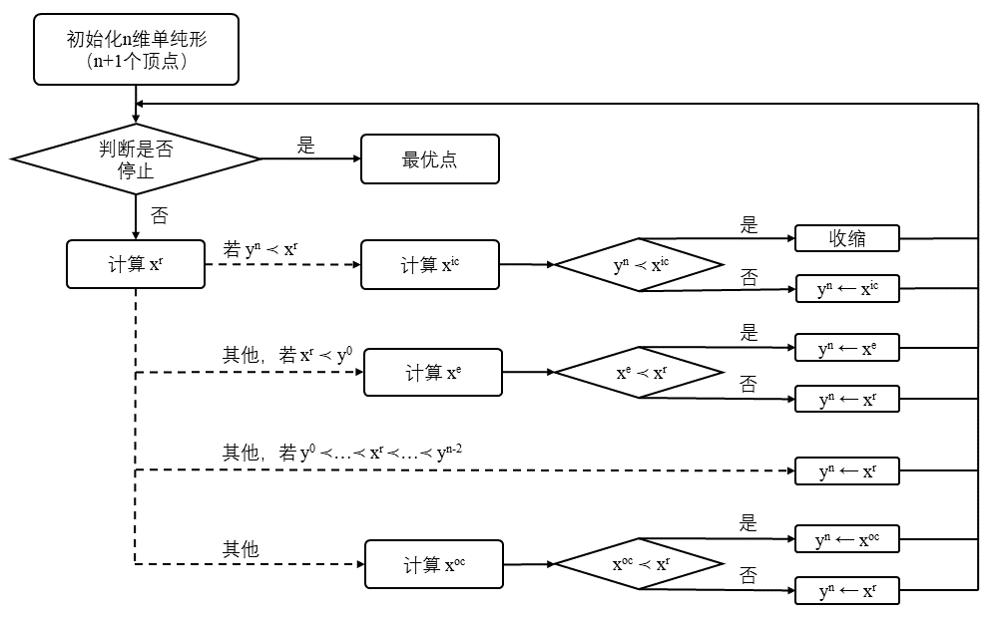

 

&emsp;&emsp;$\clubsuit$ **NM-2. 收敛性及相关研究**

&emsp;&emsp;正如引言中所指出，NM算法未必能收敛至问题最优解。1998年McKinnon提出了一个$\mathbb{R}$上的光滑的严格凸函数[2]，在该函数上，NM算法产生的实验点序列无法接近唯一的最小值。1998-2012年，人们采用多种方法改进了NM算法，使其在某些限制条件下具备一定的收敛性[1]。本文[1] (2018)则是将NM算法融入了Mads算法，利用Mads的收敛性分析来确保算法收敛。
 

#### 
3.Mads不等式约束优化算法

##### 3.1 目标问题

&emsp;&emsp;考虑不等式约束优化问题
$$\quad\begin{aligned}&\underset{x\in X\subset\mathrm{R}^n}{\mathrm{min} } f(x)\\&s.t.\quad c(x)\leq 0\\\end{aligned}$$

&emsp;&emsp;其中$f:X\mapsto\mathrm{R}\cup\infty$，$c:X\mapsto(\mathrm{R}\cup\infty)^m$，$c=(c_1,\cdots,c_m)^T$，$X$是$\mathbb{R}^n$的子集，$f$与$c$的平滑性无要求。

##### 3.2 整体思路

&emsp;&emsp;Mads是一种被广泛使用的黑盒优化算法，其核心思路是：在给定区域内初始化一个点，通过不断搜索-轮询来迭代优化当前点，直至满足预先设定的停止条件为止。对于不等式约束优化问题3.1，我们还需要给Mads添加一些“障碍”来满足约束条件，以避免算法在不可行域中浪费太多的时间，并确保最终输出的最优解在可行域中。常用的约束手段有极限障碍(EB)、渐进障碍(PB)等。本文献[1]作者使用了渐进障碍(PB)来处理不等式约束条件。因此Mads每一步迭代的流程为：搜索-轮询-障碍(PB)【详见3.4-Mads-1】。搜索让算法避免落入局部最优解，轮询确保了算法的收敛性，障碍满足了目标问题的约束条件【详见3.4-Mads-2】。

##### 3.3 基本概念

&emsp;&emsp;$\spadesuit$ **定义3.1 (正张成集)：** 给定向量空间$V$，若集合$S$的元素的非负线性组合可以张成$V$，则称$S$为$V$的正张成集。

&emsp;&emsp;$\spadesuit$ **定义3.2 (网格)：** 设$G\in\mathbb{R}^{n\times n}$为可逆矩阵，$Z\in\mathbb{Z}^{n\times p}$满足$Z$的列向量构成一个$\mathbb{R}^n$的正张成集，设$D=GZ$。

&emsp;&emsp;&emsp;对于当前最优解$x^k\in\mathbb{R}^n$，以$x^k$为中心，尺寸为$\delta^k$的网格定义为$$
M^k=\{x^k+\delta^kDy\quad y\in\mathbb{N}^{p}\}\subset\mathbb{R}^n$$

&emsp;&emsp;&emsp;其中$\delta^k$称为网格尺寸参数。

&emsp;&emsp;$\spadesuit$ **定义3.3 (框架)：** 设$G\in\mathbb{R}^{n\times n}$为可逆矩阵，$Z\in\mathbb{Z}^{n\times p}$满足$Z$的列向量构成一个$\mathbb{R}^n$的正张成集，设$D=GZ$。

&emsp;&emsp;&emsp;对于网格尺寸参数$\delta^k$，取$\Delta^k$满足$\Delta^k\geq\delta^k$，则以$x^k$为中心，尺寸为$\Delta^k$的框架定义为$$
F^k=\{x\in M^k\quad ||x-x^k||_{\infty}\leq\Delta^kb\}
$$

&emsp;&emsp;&emsp;其中$b=max\{||d'||_{\infty}: d'\in\mathbb{D}\}$，$\mathbb{D}$表示矩阵$D$的列向量构成的集合；$\Delta^k$称为框架尺寸参数。

&emsp;&emsp;$\spadesuit$ **定义3.4 (违约函数)：** 设约束条件的索引集$J=\{1,2,\cdots,m\}$，定义违约函数
$$h(x)=\left\{\begin{array}{ll}
        \sum_{j \in J}\left(\max \left\{c_{j}(x), 0\right\}\right)^{2} & \text {若 } x \in X \\
        \infty & \text {其他 }
        \end{array}\right.$$

&emsp;&emsp;&emsp;$h(x)$总是非负的，$h(x)=0\iff$$x$在问题的可行域中，即$x\in\Omega =\{x\in X:c(x)\leq 0\}$.

&emsp;&emsp;$\spadesuit$ **定义3.5 (控制)：** $x,y\in\mathbb{R}^n$，若

&emsp;&emsp;&emsp;&emsp;$\bullet$ $x,y$均可行，且$f(x)<f(y)$；或
&emsp;&emsp;&emsp;&emsp;$\bullet$ $x,y$均不可行，且$f(x)\leq f(y)，h(x)\leq h(y)$，且两不等式中至少一个满足严格不等号

&emsp;&emsp;&emsp;则称$x$控制$y$，记作$x \prec y$.

&emsp;&emsp;$\spadesuit$ **定义3.6 (更好)：** 定义函数$\operatorname{Best}:\mathbb{R}^n\times\mathbb{R}^n\longmapsto\mathbb{R}^n$
$$    \operatorname{Best}(x, y)=\left\{\begin{array}{cl}
      x & \text {若 } x \prec  y \text {或 }h(x)<h(y)\\
      y & \text {若 } y \prec  x \text {或 }h(y)<h(x)\\
      \operatorname{Older}(x, y) & \text {若 } f(x)=f(y) \text {且 }h(x)=h(y)
      \end{array}\right.\\$$

&emsp;&emsp;&emsp;易证$\operatorname{Best}$具有传递性。若$x=\operatorname{Best}(x,y)$，则称$x$比$y$更好。

&emsp;&emsp;$\spadesuit$ **注释Ⅱ：** 这里针对不等式约束优化的目标问题3.1给出了新的“控制”和“更好”定义。

##### 3.4 算法细节

&emsp;&emsp;$\clubsuit$ **Mads-1. 搜索-轮询-障碍(PB)**

&emsp;&emsp;为了方便读者理解，我们先不设置障碍(PB)，仅通过无约束优化问题2.1介绍Mads的搜索-轮询过程；进而考虑不等式约束优化问题3.1，介绍Mads的搜索-轮询-障碍(PB)过程。

&emsp;&emsp;$\bullet$ **Mads-1-1. 无约束优化：搜索-轮询**

&emsp;&emsp;&emsp;对于无约束优化的目标问题2.1，我们沿用定义2.1-2.3“控制”、“更旧”和“更好”。初始化参数

&emsp;&emsp;&emsp;&emsp;&emsp;&emsp;&emsp;$x^0\in X\qquad\qquad\qquad\qquad\;\,\;\,\,$迭代起点，必须在$f(x)$的定义域$X$中；
&emsp;&emsp;&emsp;&emsp;&emsp;&emsp;&emsp;$D=GZ\qquad\qquad\qquad\quad\quad\;\,$预先设置的正张成矩阵，用于生成网格和框架；
&emsp;&emsp;&emsp;&emsp;&emsp;&emsp;&emsp;$\Delta^0\in(0,\infty)\qquad\qquad\qquad\quad$框架尺寸参数初值；
&emsp;&emsp;&emsp;&emsp;&emsp;&emsp;&emsp;$\tau\in(0,1)\qquad\qquad\qquad\qquad\;$网格尺寸调整参数；
&emsp;&emsp;&emsp;&emsp;&emsp;&emsp;&emsp;$\epsilon_{stop}\in [0,\infty)\qquad\qquad\qquad\,\,\,\,$允许停止条件。

&emsp;&emsp;&emsp;&emsp;**Step1. (更新参数)** 对于第$k$步迭代得到的最优点$x^k$，取网格参数$\delta^k=min\{\Delta^k,(\Delta^k)^2\}$，生成网格$$
M^k=\{x^k+\delta^kDy\quad y\in\mathbb{N}^{p}\}\subset\mathbb{R}^n$$

&emsp;&emsp;&emsp;&emsp;**Step2. (搜索)** 用一种启发式算法（文献[1][3]并未言明）在$M^k$上取一个有限子集$S^k$，

&emsp;&emsp;&emsp;&emsp;&emsp;&emsp;$\bullet$ 若$\exists t\in S^k$，使得$f(t)<f(x^k)$，则$x^{k+1}\leftarrow t，\Delta^{k+1}\leftarrow\tau^{-1}\Delta^k$，进行Step4;
&emsp;&emsp;&emsp;&emsp;&emsp;&emsp;$\bullet$ 否则进行Step3.

&emsp;&emsp;&emsp;&emsp;**Step3. (轮询)** 随机选取$\mathbb{D}$的一个子集$\mathbb{D}^k_{\Delta}$，以$x^k$为中心，生成轮询集$$
P^k=\{x^k+\delta d\quad d\in \mathbb{D}^k_{\Delta} \}\subset F^k
$$

&emsp;&emsp;&emsp;&emsp;&emsp;&emsp;$\bullet$ 若$\exists t\in P^k$，使得$f(t)<f(x^k)$，则$x^{k+1}\leftarrow t，\Delta^{k+1}\leftarrow\tau^{-1}\Delta^k$;
&emsp;&emsp;&emsp;&emsp;&emsp;&emsp;$\bullet$ 否则$x^{k+1}\leftarrow x^k，\Delta^{k+1}\leftarrow\tau\Delta^k$.

&emsp;&emsp;&emsp;&emsp;**Step4. (检验)** 判断是否满足停止条件

&emsp;&emsp;&emsp;&emsp;&emsp;&emsp;$\bullet$ 若$\Delta^{k+1}\geq\epsilon_{stop}$，则$k+1\leftarrow k$，重复Step1;
&emsp;&emsp;&emsp;&emsp;&emsp;&emsp;$\bullet$ 否则输出$x^{k+1}$

&emsp;&emsp;&emsp;为了方便理解，下图绘制了三组不同的$\Delta^k,\delta^k$对应的网格图像，其中灰色网格的交点构成网格$M^k$，黑色框架及内部的格点构成框架$F^k$，$P=\{p^1,p^2,p^3\}$构成一个轮询集。

 

&emsp;&emsp;&emsp;无约束优化Mads流程图

 

&emsp;&emsp;$\bullet$ **Mads-1-2. 不等式约束优化：搜索-轮询-障碍(PB)**

&emsp;&emsp;&emsp;对于不等式约束优化的目标问题3.1，我们使用定义3.5-3.6“控制”和“更好”。问题要求Mads找到的最优解在可行域中，渐进障碍(PB)对此的处理思路是：令Mads的第$k$步迭代尽可能输出两个点，即可行域中当前最优点$x_{inf}^k$和不可行域中$h(x)$值较小且$f(x)$值更小的最优点$x_{inf}^k$。换言之，每一步迭代中Mads除了在可行域$\Omega$中寻找$x_{feas}^k$，满足$$x_{feas}^k\prec x_{feas}^{k-1}$$

还会更新一个逐渐变小的违约函数障碍阈值$h^k_{max}$，并在$X\setminus\Omega$中搜索$x_{inf}^k$，满足$$h(x_{inf}^k)\leq h^k_{max}\quad f(x_{inf}^k)<f(x_{feas}^k)\quad (x_{inf}^k\prec x_{inf}^{k-1},\;\text{若 }x_{inf}^{k-1}\text{存在 })$$

若存在这样的$x_{inf}^k$，则输出$x_{feas}^k$和$x_{inf}^k$，否则只输出$x_{feas}^k$。
 
&emsp;&emsp;&emsp;下图直观地展示了搜索-轮询-障碍(PB)的原理，13个圆圈表示第$k$步搜索-轮询评估过的13个点。图上有2个可行点，位于$h=0$的纵轴上，$f$值最小的那个用深色圆圈表示，记为$x^{feas}$;共有11个不可行点，其中6个被其他点控制，1个违约函数的值超过了$h^k_{max}$，其余4个未被支配的点显示为深色圆圈。在这4个点中，$f$值最小的不可行记作$x^{inf}$。则本次迭代输出结果为$x_{feas}^k=x^{feas}，x_{inf}^k=x^{inf}$.

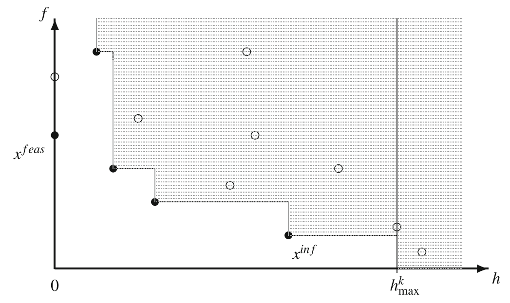

 

&emsp;&emsp;&emsp;初始化参数

&emsp;&emsp;&emsp;&emsp;&emsp;&emsp;&emsp;$x^0=x_{feas}^0=x_{inf}^0\in X\qquad\qquad\;\,\;\,\,$迭代起点，必须在$f(x)$的定义域$X$中；
&emsp;&emsp;&emsp;&emsp;&emsp;&emsp;&emsp;$D=GZ\qquad\qquad\qquad\;\,\qquad\quad\quad\;\,$预先设置的正张成矩阵，用于生成网格和框架；
&emsp;&emsp;&emsp;&emsp;&emsp;&emsp;&emsp;$\Delta^0\in(0,\infty)\qquad\qquad\qquad\;\,\qquad\quad$框架尺寸参数初值；
&emsp;&emsp;&emsp;&emsp;&emsp;&emsp;&emsp;$\tau\in(0,1)\qquad\qquad\qquad\;\,\qquad\qquad\;$网格尺寸调整参数；
&emsp;&emsp;&emsp;&emsp;&emsp;&emsp;&emsp;$h^0_{max}=\infty\quad\qquad\qquad\qquad\;\,\qquad\;\;\,\,$障碍阈值初值；
&emsp;&emsp;&emsp;&emsp;&emsp;&emsp;&emsp;$\epsilon_{stop}\in [0,\infty)\qquad\qquad\qquad\qquad\;\,\,\,\,\,$允许停止条件。

&emsp;&emsp;&emsp;由于搜索-轮询-障碍的过程较为复杂，这里仅绘制流程图阐述

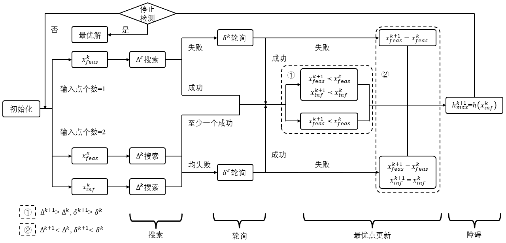

 

&emsp;&emsp;$\clubsuit$ **Mads-2. 收敛性分析**

&emsp;&emsp;收敛性的严格论证较为复杂，文献[1]仅给出结论：如果测试点序列属于一个有界集，且更新方向集合足够丰富，则存在一个聚点$x^*$:

&emsp;&emsp;&emsp;&emsp;$\bullet$ 若$x^*$可行，则$x^*$在可行域$\Omega$的每个超切线方向$d$上，广义Clarke方向导数$f^{o}(x^*;d)$是非负的；
&emsp;&emsp;&emsp;&emsp;$\bullet$ 若$x^*$不可行，则$x^*$在集合$X$的每个超切线方向$d$上，广义Clarke方向导数$h^{o}(x^*;d)$是非负的。

&emsp;&emsp;只要确保每一次搜索时$S^k$是网格$M^k$的有限子集，Mads的收敛性就与搜索步骤无关[1]。
 

#### 
4.Mads-NM不等式约束优化算法

##### 4.1 目标问题

&emsp;&emsp;考虑不等式约束优化问题（同3.1）
$$\quad\begin{aligned}&\underset{x\in X\subset\mathrm{R}^n}{\mathrm{min} } f(x)\\&s.t.\quad c(x)\leq 0\\\end{aligned}$$

&emsp;&emsp;其中$f:X\mapsto\mathrm{R}\cup\infty$，$c:X\mapsto(\mathrm{R}\cup\infty)^m$，$c=(c_1,\cdots,c_m)^T$，$X$是$\mathbb{R}^n$的子集，$f$与$c$的平滑性无要求。

##### 4.2 整体思路

&emsp;&emsp;文献[1]融合NM与Mads的思路是，将Mads每一步迭代的直接搜索替换为NM搜索，即：第$k$步最优点$x^k$【详见Mads-NM-1】$\longrightarrow$Mads生成网格$M^k$$\longrightarrow$网格上生成单纯形$\mathbb{Y}^k$【详见Mads-NM-2】$\longrightarrow$NM执行Mads搜索【详见Mads-NM-3】$\longrightarrow$Mads轮询$\longrightarrow$Mads障碍$\longrightarrow$第$k+1$步最优点$x^{k+1}$。每次迭代NM评估的点集$S^k$是$M^k$的有限子集，故Mads-NM具备收敛性【详见Mads-NM-4】。

##### 4.3 基本概念

&emsp;&emsp;$\spadesuit$ **定义4.1 (舍入点)** NM执行Mads搜索过程中，$x^{r},x^{e},x^{oc},x^{ic}$可能不在网格上,此时用最近的网格点舍入$$x^{r}_{\oplus},x^{e}_{\oplus},x^{oc}_{\oplus},x^{ic}_{\oplus}\longleftarrow x^{r},x^{e},x^{oc},x^{ic}$$

&emsp;&emsp;&emsp;下标$\oplus$表示该点位于网格上。中心点$x^c$无需对网格进行舍入，因为NM不评估$x^c$的函数值。此外，NM执行Mads搜索的过程中并不会进行收缩操作，因为收缩可能会引入大量的舍入步骤，增大Mads搜索的成本。

&emsp;&emsp;$\spadesuit$ **定义4.2 (支配/被支配集)** 根据定义3.5“支配”关系，定义$\mathbb{Y}^0$和$\mathbb{Y}^n$$$\mathbb{Y}^0=\{y\in \mathbb{Y}：\not\exists x\in \mathbb{Y},\;x\prec y\}\\\mathbb{Y}^n=\{y\in \mathbb{Y}：\not\exists x\in \mathbb{Y},\;y\prec x\}$$

&emsp;&emsp;&emsp;$\mathbb{Y}^0$包含了不被任何其他顶点支配的所有顶点，$\mathbb{Y}^n$包含了不支配其他任何顶点的所有顶点。$\mathbb{Y}^0$与$\mathbb{Y}^n$均非空，但可能有交集。

&emsp;&emsp;$\spadesuit$ **定义4.3 (区域)** NM执行Mads搜索时，由于引入了$\mathbb{Y}^0,\mathbb{Y}^n$和违约函数$h(x)$，“区域”的定义需要调整。设$\mathbb{Y}=\{y^0,y^1,\cdots,y^n\}$为$R^n$上的有序单纯形，$\mathbb{Y}^0,\mathbb{Y}^n$为$\mathbb{Y}$的子集，测试点$x\in\mathbb{R}^n$

&emsp;&emsp;&emsp;$\bullet$ 若$\exists y^i\in\mathbb{Y}^n$使得$y^i\prec x$，或$h(x)>h(y^n)$，则$x$属于内缩区域；
&emsp;&emsp;&emsp;$\bullet$ 其余情况，若$\exists y^i\in\mathbb{Y}^0$使得$x\prec y^i$，则$x$属于扩张区域；
&emsp;&emsp;&emsp;$\bullet$ 其余情况，若$x$至少掌控了$\mathbb{Y}$中的两个点，则$x$属于反射区域；
&emsp;&emsp;&emsp;$\bullet$ 其余情况，即$x$掌控了$\mathbb{Y}$中的零或一个点，则$x$属于外缩区域。

##### 4.4 算法细节

&emsp;&emsp;$\clubsuit$ **Mads-NM-1. 迭代输入** 

&emsp;&emsp;在渐进障碍法(PB)，中，每一步迭代最多有两个当前最优解：一个是算法迄今为止发现的最佳可行解，称为主轮询中心；另一个是$h$值最小的不可行解，称为次轮询中心。在Mads-NM算法中，我们只考虑主轮询中心。即第$k$步迭代的输出（第$k+1$步迭代的输入）为：当前最优解（主轮询中心）$x^k$，框架尺寸参数$\Delta^k$，违约函数障碍阈值$h^k_{max}$，以及截至第$k$步迭代为止算法评估过的点集$V^k$。

&emsp;&emsp;$\clubsuit$ **Mads-NM-2. 生成单纯形** 

&emsp;&emsp;Mads-NM开始前，设置参数$\pi_{radius}\geq 1,\pi_{svd}>0$，对于第$k+1$次迭代，定义采样集$$\mathbb{T}_{\pi_{radius}}=\{x\in V^k：|x_i-x_i|^k\leq\pi_{radius}\Delta_i^k,\;i\in \{1,2,\cdots,n\}\}$$

&emsp;&emsp;根据定义3.6将$\mathbb{T}_{\pi_{radius}}$中的点排序，使得$x_{i-1}=\operatorname{Best}(x_{i-1},x_i),\; (i=1,2,\cdots,p_k)$,$$\mathbb{T}_{\pi_{radius}}=\{x_0,x_1,\cdots,x_{p_k}\}$$

&emsp;&emsp;注意到$x_0=x^k$，根据定义3.2“网格”可知$\mathbb{T}_{\pi_{radius}}\subset M^{k}$.

&emsp;&emsp;&emsp;**step1. (添加顶点)** 初始化$\mathbb{Y}=\{x_0\}$，$i$从$1$到$p_k$进行如下循环：

&emsp;&emsp;&emsp;生成矩阵$A=\{y-x_0：y\in\mathbb{Y},\;y\not=x_0\}\cup\{x_i-x_0\}$，

&emsp;&emsp;&emsp;&emsp;$\bullet$ 若$diag(\Delta^k)^{-1}A$的奇异值$\geq \pi_{svd}$，则$\mathbb{Y}\leftarrow\mathbb{Y}\cup\{x_i\}$;
&emsp;&emsp;&emsp;&emsp;$\bullet$ 否则$\mathbb{Y}\leftarrow\mathbb{Y}$.

&emsp;&emsp;&emsp;**step2. (输出单纯形)** 判断生成单纯形$\mathbb{Y}$的顶点个数

&emsp;&emsp;&emsp;&emsp;$\bullet$ 若$|\mathbb{Y}|=n+1$，则输出$\mathbb{Y}$;
&emsp;&emsp;&emsp;&emsp;$\bullet$ 否则输出$\mathbb{Y}=\emptyset$.

&emsp;&emsp;根据生成的单纯形的输出结果$\mathbb{Y}$，NM会在$M^k$上执行Mads搜索，进而进入Mads轮询。

&emsp;&emsp;$\clubsuit$ **Mads-NM-3. NM执行Mads搜索** 

&emsp;&emsp;在第$k+1$步Mads-NM迭代中，对于生成的单纯形$\mathbb{Y}\subset V^k$

&emsp;&emsp;&emsp;**step1. (更新单纯形)** 

&emsp;&emsp;&emsp;&emsp;$\bullet$ 若$\mathbb{Y}$不是一个单纯形，进行Step4;
&emsp;&emsp;&emsp;&emsp;$\bullet$ 否则排序$\mathbb{Y}=\{y^0,y^1,\cdots,y^n\}$并计算$\mathbb{Y}^0$和$\mathbb{Y}^n$.

&emsp;&emsp;&emsp;**step2. (寻找新顶点)** 

&emsp;&emsp;&emsp;&emsp;$\bullet$ 若$x^r_{\oplus}$属于内缩区域且$x^{ic}_{\oplus}$属于内缩区域，则进行Step4；
&emsp;&emsp;&emsp;&emsp;$\bullet$ 若$x^r_{\oplus}$属于内缩区域且$x^{ic}_{\oplus}$不属于内缩区域，取$t=x^{ic}_{\oplus}$；
&emsp;&emsp;&emsp;&emsp;$\bullet$ 除上述情况，若$x^r_{\oplus}$属于扩张区域，取$t=\operatorname{Best}(x^r_{\oplus},x^e_{\oplus})$；
&emsp;&emsp;&emsp;&emsp;$\bullet$ 除上述情况，若$x^r_{\oplus}$属于反射区域，取$t=x^{r}_{\oplus}$；
&emsp;&emsp;&emsp;&emsp;$\bullet$ 除上述情况，即$x^r_{\oplus}$属于外缩区域，取$t=\operatorname{Best}(x^r_{\oplus},x^{oc}_{\oplus})$；

&emsp;&emsp;&emsp;**step3. (替换最差点)** 

&emsp;&emsp;&emsp;&emsp;$\bullet$ 若$t\in V^k$，进行Step4;
&emsp;&emsp;&emsp;&emsp;$\bullet$ 否则用$t$替换$y^n$，进行步骤Step1.

&emsp;&emsp;&emsp;**step4. (停止NM迭代)** 输出Step2访问过的测试点集

&emsp;&emsp;NM停止可能有以下原因：

&emsp;&emsp;（1）输入Mads的单纯形为空集，跳过Mads搜索直接进入轮询；
&emsp;&emsp;（2）由于对NM的替换点进行了舍入操作，替换顶点$y^n$后$\mathbb{Y}$不再是一个单纯形，此时NM终止；
&emsp;&emsp;（3）替代顶点的建议值$t$可能是之前访问过的网格点$(t\in V^k)$，为了防止出现循环，NM将终止；
&emsp;&emsp;（4）由于收缩会增大搜索步骤的成本，当原本的NM需要收缩时，NM将终止；
&emsp;&emsp;（5）算法启动前设置参数$\pi_{eval}\in \mathbb{N}$，每次NM搜索可执行的函数求值次数不能超过$\pi_{eval}$，否则NM将终止。
 

&emsp;&emsp;不等式约束优化Mads-NM流程图

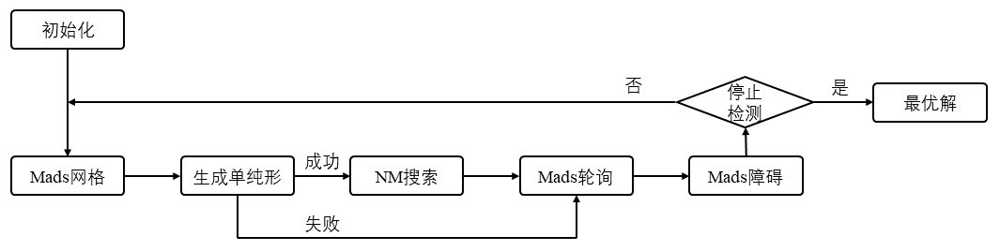

 

&emsp;&emsp;$\clubsuit$ **Mads-NM-4. 收敛性分析** 

&emsp;&emsp;对Mads算法而言，只要确保每一次搜索时$S^k$是网格$M^k$的有限子集，收敛性就与搜索步骤无关[1]。而每一次NM搜索的采样集$\mathbb{T}_{\pi_{radius}}$都是有限的，且算法保证了NM搜索不会循环卡死，故Mad-NM算法仍适用Mads的收敛性证明。

#### 
5.数值实验效果比较

&emsp;&emsp;经过一系列调参实验，文献[1]确定Mads-NM一组比较好的参数为：$\pi=(\pi_{svd},\pi_{eval},\pi_{radius})=(0.01,80n,8)$

##### 5.1 无约束优化问题的比较

&emsp;&emsp;对于无约束优化问题，文献[1]使用了Mads-NM、Mads，以及应用了NM的fminsearch、fminsearch Adapt、grid NM共5种算法，在68个不同的测试问题上进行了比较。

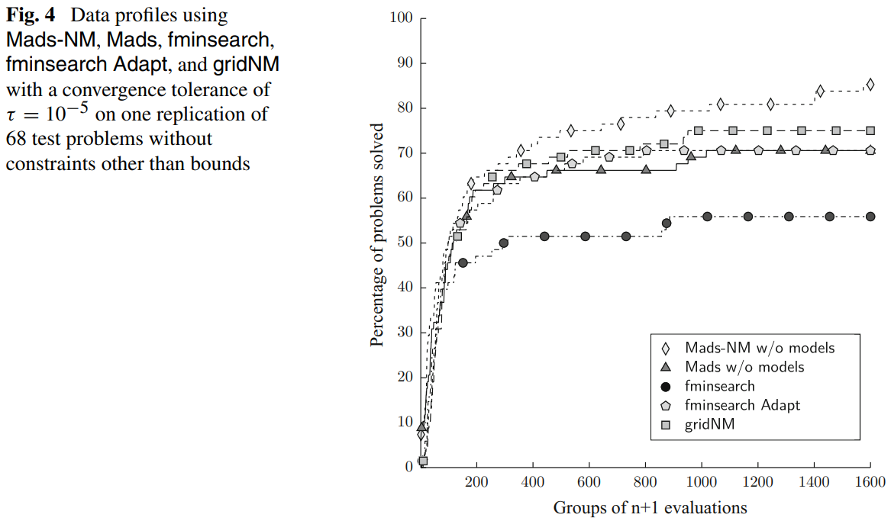

 

&emsp;&emsp;对无约束优化问题的数值实验表明，由此产生的Mads-NM算法优于Matlab实现的NM算法（fminsearch和fminsearch Adapt）、gridNM算法以及Mads算法。

##### 5.2 有约束优化问题的比较

&emsp;&emsp;对于无约束优化问题，文献[1]使用了Mads-NM与Mads算法，在3个黑盒测试问题（LOCKWOOD、MDO、STYRENE）上进行了比较。

&emsp;&emsp;**（1）LOCKWOOD**

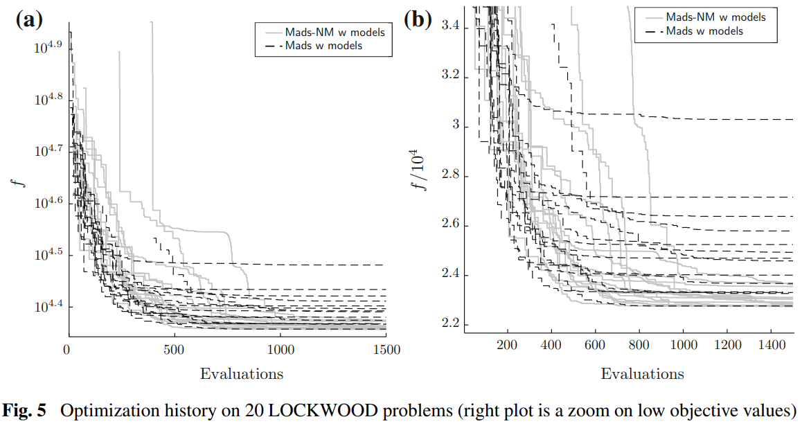

 

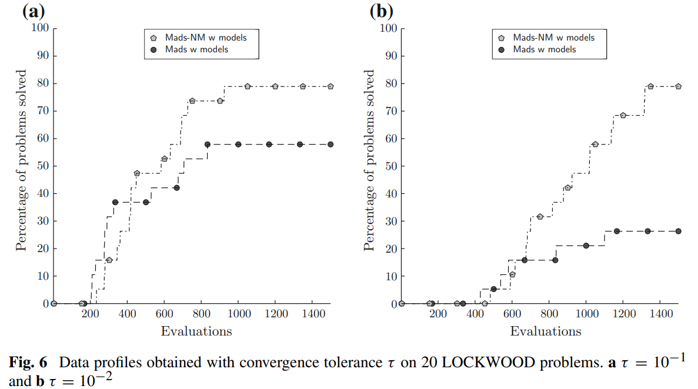

 

&emsp;&emsp;**（2）MDO** 

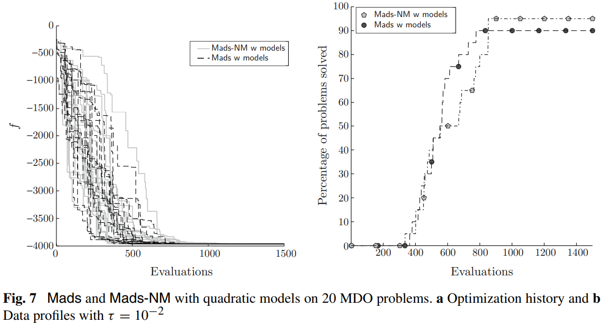

 

&emsp;&emsp;**（3）STYRENE**

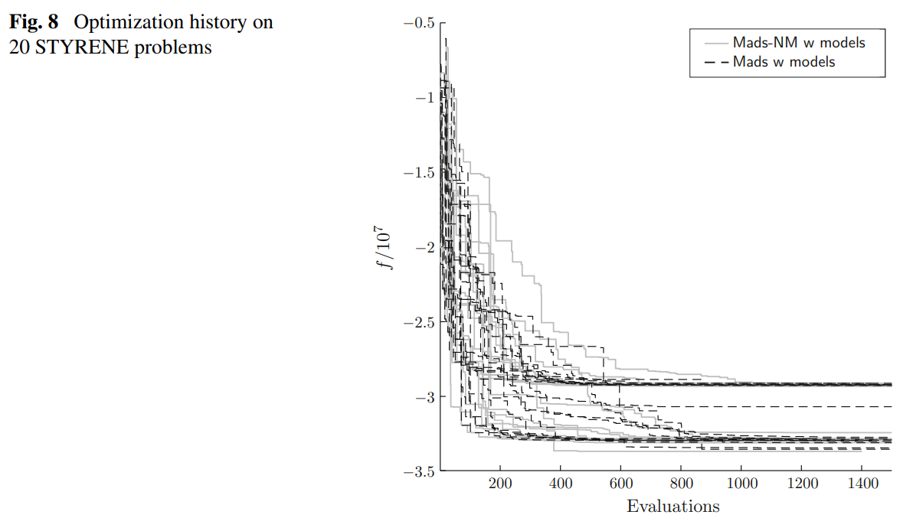

 

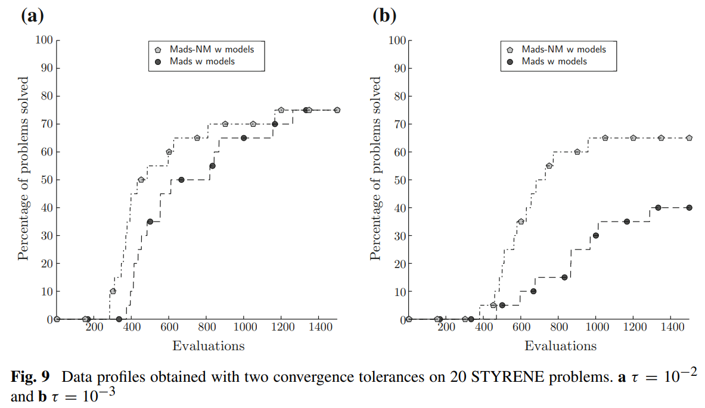

 

&emsp;&emsp;在三个有约束工程问题上的实验表明，Mads-NM算法和Mads算法在最初的数百次函数求值过程中表现相当，但随着函数求值次数的增加，Mads-NM算法通常比Mads算法更能找到更好的可行解。解决问题百分比的差异方面：对于MDO问题($\tau=10^{-2}$)差距约为$5\%$；对于STYRENE问题($\tau=10^{-3}$)差距约为$25\%$；对于LOCKWOOD问题($\tau=10^{-2}$)差距超过$50\%$.

#### 
6. 参考文献

[1]Audet, C., Tribes, C. Mesh-based Nelder–Mead algorithm for inequality constrained optimization. Comput Optim Appl 71, 331–352 (2018). 

[2]McKinnon, K.I.M.: Convergence of the Nelder–Mead simplex method to a nonstationary point. SIAMJ. Optim. 9(1), 148–158 (1998)

[3]Audet, C., Hare, W. (2017). Mesh Adaptive Direct Search. In: Derivative-Free and Blackbox Optimization. Springer Series in Operations Research and Financial Engineering. Springer, Cham. 

#### 
7. 后记

在本学期最后两周里，我围绕论文Mesh-based Nelder–Mead algorithm for inequality constrained optimization展开学习，制作PPT汇报并书写了总结报告。这是一次非常难得的经历，让我对21世纪的黑盒优化算法研究有了一定的了解。

学习过程中我曾遇到过困难：论文对Mads算法的搜索-轮询迭代以及渐进障碍(PB)的介绍均十分简略，对理解Mads-NM算法造成了很大的阻碍。但令人欣喜的是，查阅资料时我发现论文作者之一Charles Audet曾参与教材Derivative-Free and Blackbox Optimization的编写。汇报结束后，我花费了一周时间阅读此教材的第五章(Mesh Adaptive Direct Search)和第十二章(Variables and Constraints)，充分理解了PB障碍的Mads算法，并在本报告的第三节绘制了流程图进行总结。这本教材是我在学习中的意外收获，对于黑盒优化算法论述详实，值得我继续研读。

其他同学的文献汇报也让给我受益良多，文献11-13让我看到了Mads算法的不同变体，其余文献针对不同问题也引入了新的思想。

最后，衷心感谢范金燕老师和助教曹慧琳老师。在前14周的课程中我学到了许多下降方法，在15-16周的研讨中我了解到了21世纪的优化算法研究，在未来的道路上我相信也会经常需要把学到的优化知识学以致用。再次对你们的付出表示衷心的感谢。