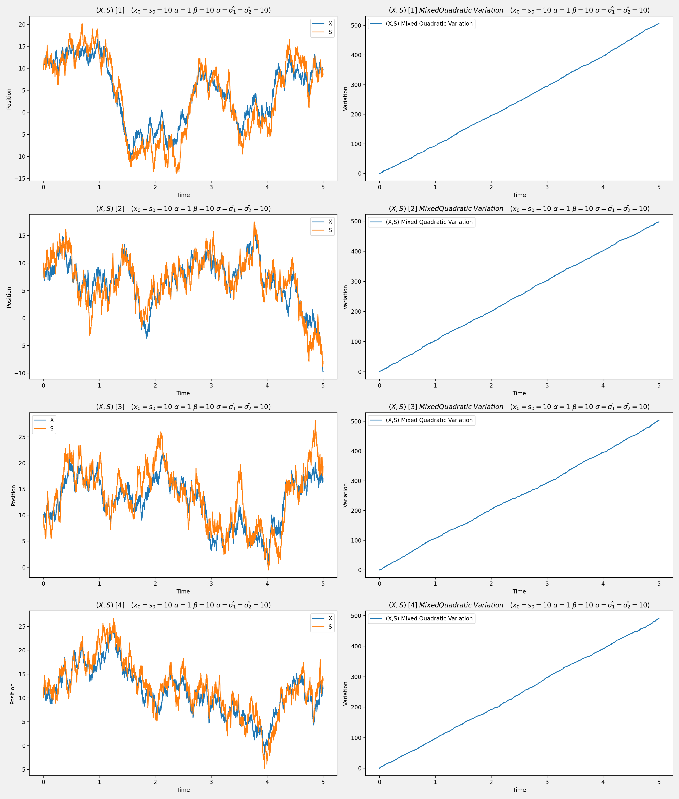

## <center>随机过程大作业</center>

<center>侯力广 521070910043</center>

#### <center>1.问题重述</center>
    
##### 问题1

&emsp;&emsp;Ⅰ）电脑生成多条布朗运动（BM）轨道；
&emsp;&emsp;Ⅱ）探究布朗运动轨道的一阶变差、二阶变差的轨道，有什么发现？

##### 问题2

&emsp;&emsp;设$B=\{B_t;t\geq 0\}$为标准布朗运动，$X=\{X_t;t\geq 0\}$为如下随机微分方程的解：
$$
\begin{cases}
dX_t=\alpha(\upsilon-X_t)dt+\sigma dB_t\\
X_0=x_0
\end{cases}
$$&emsp;&emsp;其中$\alpha,\upsilon,\sigma,x_0$为常数。
&emsp;&emsp;Ⅰ）用电脑生成$X$的多条轨道；画出过程$X$的二阶变差的轨道；
&emsp;&emsp;Ⅱ）探究不同参数对轨道本身的影响；
&emsp;&emsp;Ⅲ）探究不同参数对$X$的二阶变差的影响。

##### 问题3

&emsp;&emsp;利用两个耦合的SDE来刻画“股票$S_t$围绕其价值$X_t$上下波动”的随机现象。
&emsp;&emsp;设$B=\{B_t;t\geq 0\}$与$W=\{W_t;t\geq 0\}$为标准布朗运动，$(X_t,S_t)$为如下随机微分方程的解：
$$
\begin{cases}
dX_t=\alpha(\upsilon-X_t)dt+\sigma dB_t\\
dS_t=\theta(X_t-S_t)dt+\hat{\sigma_1}dB_t+\hat{\sigma_2}dW_t\\
X_0=x_0 , \,S_0=s_0\\
\end{cases}
$$&emsp;&emsp;其中$\alpha,\upsilon,\sigma,\theta,\hat{\sigma_1},\hat{\sigma_2},x_0,s_0$为常数。
&emsp;&emsp;Ⅰ）用电脑生成$(X,S)$的多条轨道；
&emsp;&emsp;Ⅱ）对$(X,S)$的每条轨道，画出$X$与$S$的二阶混合变差；
&emsp;&emsp;Ⅲ）探究不同参数对轨道的影响；探究不同参数对二阶混合变差的影响。 

#### <center>2.问题求解</center>
##### 问题1求解

&emsp;&emsp;**Ⅰ）生成BM轨道** 

&emsp;&emsp;取初始位置$x_0=0$，总时长$T=20s$，时间步长$dt=0.0001s$，距离变化服从正态分布作图。绘制三条布朗运动轨道。

<div align=center></div>
<br/>

&emsp;&emsp;**观察发现：** 布朗运动随机过程的轨道随机性很强。
<div STYLE="page-break-after: always;"></div>


&emsp;&emsp;**Ⅱ）生成BM一阶、二阶变差轨道** 

&emsp;&emsp;**step1.** 取变差时间步长 = $10\times$布朗运动时间步长 = $0.001s$，绘制一阶、二阶变差轨道。
&emsp;&emsp;**step2.** 取变差时间步长 = $5\times$布朗运动时间步长 = $0.0005s$，绘制一阶、二阶变差轨道。
&emsp;&emsp;**step3.** 取变差时间步长 = 布朗运动时间步长 = $0.0001s$，绘制一阶、二阶变差轨道。

<div align=center></div>
<br/>

&emsp;&emsp;**观察发现：** 满足结论：当变差划分足够细时，一阶变差趋于正无穷，二阶变差均方收敛于$t$。
<br/>

##### 问题2求解

&emsp;&emsp;**Ⅰ）生成$X$轨道** 

&emsp;&emsp;**step1.** 取布朗运动总时长$T=10s$，时间步长$dt=0.0001s$；取方程参数$\alpha=0.1,\;\upsilon=10,\;\sigma=10,\;x_0=10$。根据随机微分方程作图，绘制X的三条轨道。
&emsp;&emsp;**step2.** 取变差时间步长 = 布朗运动时间步长 = $0.0001s$，绘制$X$的二阶变差轨道。
<div align=center></div>
<div STYLE="page-break-after: always;"></div>

&emsp;&emsp;**Ⅱ,Ⅲ）探究不同参数对$X$及其二阶变差的影响** 

&emsp;&emsp;**C1. $\alpha$对$X$及二阶变差的影响** 

&emsp;&emsp;取$\sigma=3，\upsilon=20，x_0=10，T=5，dt=0.001$， $\alpha$从$0$取到$4.5$，步长$0.5$，绘制$X$轨道及其二阶变差轨道。

<div align=center></div>
<br/>

&emsp;&emsp;**观察发现：** $\alpha(>0)$越大，X的轨道趋于$\upsilon$的趋势越明显。
<div align=center></div>
<br/>

&emsp;&emsp;**观察发现：** $\alpha$对$X$的二阶变差无影响。
<div STYLE="page-break-after: always;"></div>

&emsp;&emsp;**C2. $\sigma$对$X$及二阶变差的影响**  

&emsp;&emsp;取$\alpha=5，\upsilon=20，x_0=10，T=5，dt=0.001$， $\sigma$从$1$取到$9$，步长$1$，绘制$X$轨道及其二阶变差轨道。 


<div align=center></div>
<br/>

&emsp;&emsp;**观察发现：** $\sigma(>0)$越大，$X$的轨道受到的扰动越剧烈。

<div align=center></div>
<br/>

&emsp;&emsp;**观察发现：** $\alpha(>0)$越大，$X$二阶变差轨道近似直线的斜率越大。
<div STYLE="page-break-after: always;"></div>

&emsp;&emsp;**C3. $\upsilon$对$X$及二阶变差的影响** 

&emsp;&emsp;取$\alpha=3，\sigma=2，x_0=10，T=5，dt=0.001$， $\upsilon$从$2.5$取到$25$，步长$2.5$，绘制$X$轨道及其二阶变差轨道。 

<div align=center></div>
<br/>

&emsp;&emsp;**观察发现：** 从$x_0$出发，$X$的轨道会趋向$\upsilon$运动，并最终在$\upsilon$附近平稳。

<div align=center></div>
<br/>

&emsp;&emsp;**观察发现：** $\upsilon$对$X$的二阶变差无影响。
<div STYLE="page-break-after: always;"></div>

&emsp;&emsp;**C4. $x_0$对$X$及二阶变差的影响** 

&emsp;&emsp;取$\alpha=3，\sigma=2，\upsilon=20，T=5，dt=0.001$， $x_0$从$4$取到$40$，步长$4$，绘制$X$轨道及其二阶变差轨道。

<div align=center></div>
<br/>

&emsp;&emsp;**观察发现：** 从$x_0$出发，$X$的轨道会趋向$\upsilon$运动，并最终在$\upsilon$附近平稳。

<div align=center></div>
<br/>

&emsp;&emsp;**观察发现：** $x_0$对$X$的二阶变差无影响。
<div STYLE="page-break-after: always;"></div>

&emsp;&emsp;**总结分析：**
&emsp;&emsp;方程 $dX_t=\alpha(\upsilon-X_t)dt+\sigma dB_t$ 的右端可视为确定部分 $\alpha(\upsilon-X_t)dt$ 与扰动部分 $\sigma dB_t$ 的组合。
&emsp;&emsp;**1.** $\alpha(>0)$越大，确定部分占的比重越大，随机性相对越小，$X$轨道趋于$\upsilon$的趋势越明显；$\alpha$不影响扰动部分，不影响二阶变差。
&emsp;&emsp;**2.** $\sigma(>0)$越大，扰动部分站的比重越大，随机性相对越大，$X$轨道抖动越剧烈；$\sigma$越大，扰动部分被放大的倍数越大，二阶变差近似直线的斜率越大。
&emsp;&emsp;**3.** 仅考虑确定部分的ODE：$X'+\alpha X-\alpha \upsilon=0$，其通解$X=ce^{-\alpha x}+\upsilon$，当$\alpha>0,\upsilon>0$时，$X$总是趋于$\upsilon$。加上扰动部分，该方程仍满足这种趋势。
<br/>

##### 问题3求解

&emsp;&emsp;**Ⅰ,Ⅱ）生成$(X,S)$轨道及其二阶混合变差轨道**

&emsp;&emsp;取$\alpha=1，\beta=10，\sigma=\hat{\sigma_1}=\hat{\sigma_2}=10，x_0=s_0=10，T=5，dt=0.001$，绘制四条$(X,S)$轨道及其二阶混合变差轨道。
<div align=center></div>
<div STYLE="page-break-after: always;"></div>
<br/>

&emsp;&emsp;**Ⅲ）探究不同参数对$(X,S)$及其二阶混合变差的影响**

&emsp;&emsp;**C1. $\alpha$对$(X,S)$及二阶混合变差的影响** 
&emsp;&emsp;取$\theta=\sigma=\hat{\sigma_1}=\hat{\sigma_2}=10，s_0=x_0=10，\upsilon=40，T=5，dt=0.001$， $\alpha$从$0$取到$8$，步长$1$，绘制$(X,S)$轨道及其二阶混合变差轨道。
<div align=center></div>
<br/>

&emsp;&emsp;**观察发现：** $\alpha(>0)$越大，$X,S$轨道趋于$\upsilon$的趋势越明显。

<div align=center></div>
<br/>

&emsp;&emsp;**观察发现：** $\alpha(>0)$对$(X,S)$的二阶混合变差无影响。
<div STYLE="page-break-after: always;"></div>

&emsp;&emsp;**C2. $\sigma$对$(X,S)$及二阶混合变差的影响** 
&emsp;&emsp;取$\alpha=\theta=\hat{\sigma_1}=\hat{\sigma_2}=10，s_0=x_0=10，\upsilon=40，T=5，dt=0.001$， $\alpha$从$5$取到$45$，步长$5$，绘制$(X,S)$轨道及其二阶混合变差轨道
<div align=center></div>
<br/>

&emsp;&emsp;**观察发现：** $\sigma(>0)$越大，$X$波动性越大

<div align=center></div>
<br/>

&emsp;&emsp;**观察发现：** $\sigma(>0)$越大，$(X,S)$二阶变差轨道近似的直线斜率越大。
<div STYLE="page-break-after: always;"></div>

&emsp;&emsp;**C3. $\upsilon$对$(X,S)$及二阶混合变差的影响** 
&emsp;&emsp;取$\alpha=\theta=\sigma=\hat{\sigma_1}=\hat{\sigma_2}=10，s_0=x_0=10，T=5，dt=0.001$， $\upsilon$从$-40$取到$40$，步长$10$，绘制$(X,S)$轨道及其二阶混合变差轨道
<div align=center></div>
<br/>

&emsp;&emsp;**观察发现：** 从$(x_0,s_0)$出发，$(X,S)$的轨道会趋向$\upsilon$运动，并最终在$\upsilon$附近平稳。

<div align=center></div>
<br/>

&emsp;&emsp;**观察发现：** $\upsilon$对$(X,S)$的二阶混合变差无影响。
<div STYLE="page-break-after: always;"></div>

&emsp;&emsp;**C4. $x_0$对$(X,S)$及二阶混合变差的影响** 
&emsp;&emsp;取$\alpha=\theta=\sigma=\hat{\sigma_1}=\hat{\sigma_2}=10，s_0=10，\upsilon=40，T=5，dt=0.001$， $x_0$从$0$取到$80$，步长$10$，绘制$(X,S)$轨道及其二阶混合变差轨道

<div align=center></div>
<br/>

&emsp;&emsp;**观察发现：** 从$(x_0,s_0)$出发，$(X,S)$的轨道会趋向$\upsilon$运动，并最终在$\upsilon$附近平稳。

<div align=center></div>
<br/>

&emsp;&emsp;**观察发现：** $x_0$对$(X,S)$的二阶混合变差无影响。
<div STYLE="page-break-after: always;"></div>

&emsp;&emsp;**C5. $\theta$对$(X,S)$及二阶混合变差的影响** 
&emsp;&emsp;取$\alpha=\sigma=\hat{\sigma_1}=\hat{\sigma_2}=10，x_0=s_0=10，\upsilon=40，T=5，dt=0.001$， $\theta$从$0$取到$8$，步长$1$，绘制$(X,S)$轨道及其二阶混合变差轨道
<div align=center></div>
<br/>

&emsp;&emsp;**观察发现：** $\theta(>0)$越大，$S$趋于$X$的趋势越明显。

<div align=center></div>
<br/>

&emsp;&emsp;**观察发现：** $\theta(>0)$对$(X,S)$的二阶混合变差无影响。
<div STYLE="page-break-after: always;"></div>

&emsp;&emsp;**C6. $\hat{\sigma_1}$对$(X,S)$及二阶混合变差的影响** 
&emsp;&emsp;取$\alpha=\theta=\sigma=\hat{\sigma_2}=10，x_0=s_0=10，\upsilon=40，T=5，dt=0.001$， $\hat{\sigma_1}$从$4$取到$36$，步长$4$，绘制$(X,S)$轨道及其二阶混合变差轨道

<div align=center></div>
<br/>

&emsp;&emsp;**观察发现：** $\hat{\sigma_1}(>0)$越大，$S$波动性越大。

<div align=center></div>
<br/>

&emsp;&emsp;**观察发现：** $\hat{\sigma_1}(>0)$越大，$(X,S)$二阶变差轨道近似的直线斜率越大。
<div STYLE="page-break-after: always;"></div>

&emsp;&emsp;**C7. $\hat{\sigma_2}$对$(X,S)$及二阶混合变差的影响** 
&emsp;&emsp;取$\alpha=\theta=\sigma=\hat{\sigma_1}=10，x_0=s_0=10，\upsilon=40，T=5，dt=0.001$， $\hat{\sigma_2}$从$4$取到$36$，步长$4$，绘制$(X,S)$轨道及其二阶混合变差轨道

<div align=center></div>
<br/>

&emsp;&emsp;**观察发现：** $\hat{\sigma_2}(>0)$越大，$S$波动性越大。

<div align=center></div>
<br/>

&emsp;&emsp;**观察发现：** $\hat{\sigma_2}(>0)$对$(X,S)$二阶变差无影响。
<div STYLE="page-break-after: always;"></div>

&emsp;&emsp;**C8. $s_0$对$(X,S)$及二阶混合变差的影响** 
&emsp;&emsp;取$\alpha=\theta=\sigma=\hat{\sigma_1}=\hat{\sigma_2}=10，x_0=10，\upsilon=40，T=5，dt=0.001$， $s_0$从$0$取到$80$，步长$10$，绘制$(X,S)$轨道及其二阶混合变差轨道

<div align=center></div>
<br/>

&emsp;&emsp;**观察发现：** 从$(x_0,s_0)$出发，$(X,S)$的轨道会趋向$\upsilon$运动，并最终在$\upsilon$附近平稳。

<div align=center></div>
<br/>

&emsp;&emsp;**观察发现：** $s_0$对$(X,S)$的二阶混合变差无影响
<div STYLE="page-break-after: always;"></div>

#### <center>3.总结与感想</center>
&emsp;&emsp;本次大作业中，我运用Python编程，数值模拟求解了随机微分方程，这是一次难得的利用计算机编程的方式来解决数学问题的实操。作为一名数学学院的学生，平时很少有课程是直接通过计算机编程来求解的，而随机过程的这次大作业是一次很好的锻炼，让平时看似抽象脱离实际的数学和现实接轨，不仅加深了我对$numpy，matplotlib$库的运用熟练程度，也加深了对随机微分方程的理解。

&emsp;&emsp;与传统的微分方程不同，随机微分方程的求解要考虑确定项$dt$和扰动项$dB_t$对解的影响。这两项的变化对解的贡献随着参数的大小而变化。确定项$dt$即确定性函数对应的部分，反应轨道的整体性质，而扰动项$dB_t$反应轨道的波动性。在参数不同的情况下，也有不同的主次关系，例如在第二问中$\alpha$的变大导致轨线由随机性很强渐变为具有一致的上升性叠加较小的波动。而$\sigma$增大时轨道就没有特别明显的总体趋势。因此，在实际问题中，例如对股价和价值的模拟，通过参数的调整来进行更为精确的近似，是很重要的，例如在整体大盘上涨时，就好比$\alpha$较大时整体的上涨趋势，而震荡盘中$\sigma$的值就会相应的变大。

&emsp;&emsp;最后，要着重感谢熊德文老师和助教老师。我在大作业的解题中碰到许多问题后，寻求你们的帮助都一一解决了。在未来的道路上，我相信也会经常需要把随机过程课上的知识学以致用，因此对你们的付出表示衷心的感谢。

#### <center>4.代码附录</center>

##### **问题1-1代码**

```python
import numpy as np
import matplotlib.pyplot as plt

#定义布朗运动函数
#生成N条布朗运动轨迹，时间间隔为dt，总时间为T，从位置x0开始运动
def brownian_motion(N, T, dt, x0):

    #在[0,T]上生成等间隔的时间点，每个时间点的间隔为dt
    t = np.linspace(0, T, int(T/dt)+1)

    #生成一个N*len(t)的矩阵，每行是一个时间点的随机增量，每列是一条轨迹的随机增量
    #每个随机增量都是一个均值为0，标准差为sqrt(dt)的正态分布随机数
    dW = np.random.normal(scale=np.sqrt(dt), size=(N, len(t)))

    W = np.cumsum(dW, axis=1)#对每条轨迹进行累加
    X = x0 + W
    return t, X

#定义图像参数
N = 3
T = 20 
dt = 0.0001 
x0 = 0 

#生成布朗运动数据
t, X = brownian_motion(N, T, dt, x0)
fig,ax=plt.subplots()

#绘制布朗运动图像
for i in range(N):
    ax.plot(t, X[i])
ax.set_xlabel('Time')
ax.set_ylabel('Position')
plt.title('Brownian Motion')
plt.savefig('rp1-1-1.png',dpi=100,facecolor='#f1f1f1')
```
##### **问题1-2代码**

```python
#变差步长=10*dt
Y = X[:,::10]
t1 = t[::10]

#计算一阶变差
dY1 = np.abs(np.diff(Y, axis=1))
dY1 = np.hstack([np.zeros((N,1)), dY1])
Y_sum1 = np.cumsum(dY1, axis=1)

#计算二阶变差
dY2 = np.abs(np.diff(Y, axis=1))
dY2 = dY2**2
dY2 = np.hstack([np.zeros((N,1)), dY2])
Y_sum2 = np.cumsum(dY2, axis=1)

#--------------------------#

#变差步长=5*dt
Z = X[:,::5]
t2 = t[::5]

#计算一阶变差
dZ1 = np.abs(np.diff(Z, axis=1))
dZ1 = np.hstack([np.zeros((N,1)), dZ1])
Z_sum1 = np.cumsum(dZ1, axis=1)

#计算二阶变差
dZ2 = np.abs(np.diff(Z, axis=1))
dZ2 = dZ2**2
dZ2 = np.hstack([np.zeros((N,1)), dZ2])
Z_sum2 = np.cumsum(dZ2, axis=1)

#--------------------------#

#变差步长=dt

#计算一阶变差
dX1 = np.abs(np.diff(X, axis=1))
dX1 = np.hstack([np.zeros((N,1)), dX1])
X_sum1 = np.cumsum(dX1, axis=1)

#计算二阶变差
dX2 = np.abs(np.diff(X, axis=1))
dX2 = dX2**2
dX2 = np.hstack([np.zeros((N,1)), dX2])
X_sum2 = np.cumsum(dX2, axis=1)

#--------------------------#
fig, ax = plt.subplots(2, 3, figsize=(15, 10))  # 创建2行3列的子图

# 第一列
for i in range(N):
    ax[0, 0].plot(t1, Y_sum1[i])
    ax[1, 0].plot(t1, Y_sum2[i])
ax[0, 0].set_title('BM Linear Variation (step=10*dt)')  
ax[1, 0].set_title('BM Quadratic Variation (step=10*dt)')  

# 第二列
for i in range(N):
    ax[0, 1].plot(t2, Z_sum1[i])
    ax[1, 1].plot(t2, Z_sum2[i])
ax[0, 1].set_title('BM Linear Variation (step=5*dt)')  
ax[1, 1].set_title('BM Quadratic Variation (step=5*dt)')  

# 第三列
for i in range(N):
    ax[0, 2].plot(t, X_sum1[i])
    ax[1, 2].plot(t, X_sum2[i])
ax[0, 2].set_title('BM Linear Variation (step=dt)')  
ax[1, 2].set_title('BM Quadratic Variation (step=dt)')  

for a in ax.flat:
    a.set(xlabel='Time', ylabel='Variation')

plt.tight_layout()  
plt.savefig('rp1-2-1.png', dpi=500, facecolor='#f1f1f1')
```
##### **问题2-1代码**

```python
import numpy as np
import matplotlib.pyplot as plt
from scipy.integrate import odeint
import sympy
import pylab as mpl
import numpy as np
import matplotlib.pyplot as plt
from pylab import *
import matplotlib

#定义X的函数
#生成N条X的轨迹，时间间隔为dt，总时间为T，初始值为x0，参数为afa，sigma，v
def brownian_motion2(N, T,dt, x0,afa,sigma,v):

    #在[0, T]上产生等间隔的时间点，每个时间间隔为dt
    t = np.linspace(0, T, int(T/dt)+1)

    #初始化一个长度与时间点个数相同的数组，用于存放每个时间点的X的值
    xt=[0]*len(t)
    xt[0]=x0

    #对于每个时间点，根据随机微分方程，用前一个时间点的X的值计算下一个时间点的X的值
    for i in range(len(t)-1):
        xt[i+1]=xt[i]+afa*(v-xt[i])*dt+sigma*np.random.normal(scale=np.sqrt(dt))
    return t, xt

#定义图像参数
N = 3
T = 10
dt = 0.0001
x0 = 10
afa = 0.1
sigma = 10
v = 10

fig, ax = plt.subplots(1, 2, figsize=(15, 7))  # 创建1行2列的子图

# 绘制X的轨迹图
X=[0]*N
for i in range(N):
    t,X[i]=brownian_motion2(N, T,dt, x0,afa,sigma,v)
    ax[0].plot(t,X[i])  
ax[0].set_xlabel(r'$Time$',)
ax[0].set_ylabel(r'$Position$')
ax[0].set_title('$X\quad$$( x_0 = 10 \\ \\alpha =0.1 \\ \\sigma=10 \\ v=10 )$')

# 计算X的二阶变差
dX2 = np.abs(np.diff(X, axis=1))
dX2 = dX2**2
dX2 = np.hstack([np.zeros((N,1)), dX2])
X_sum2 = np.cumsum(dX2, axis=1)

# 绘制X的二阶变差图
for i in range(N):
    ax[1].plot(t,X_sum2[i])
ax[1].set_xlabel(r'$Time$',)
ax[1].set_ylabel(r'$Variation$')
ax[1].set_title('$X\;\; \t{Quadratic\; Variation}\quad( x_0 = 10 \\ \\alpha =0.1 \\ \\sigma=10 \\ v=10 )$')

plt.tight_layout()  
plt.savefig('rp2-1-1.png',dpi=200,facecolor='#f1f1f1')
```

##### **问题2-2，2-3代码**

```python
##2-2-alpha

#定义X的函数
def brownian_motion2(N, T,dt, x0,afa,sigma,v):
    t = np.linspace(0, T, int(T/dt)+1)
    xt=[0]*len(t)
    xt[0]=x0
    for i in range(len(t)-1):
        xt[i+1]=xt[i]+afa*(v-xt[i])*dt+sigma*np.random.normal(scale=np.sqrt(dt))
    return t, xt

#定义图像参数
N = 3
T = 5
dt = 0.001
x0 = 10
sigma = 3
v = 20
afa = np.arange(0, 4.5, 0.5)

#绘制X的轨迹图
X=[0]*N
fig,ax=plt.subplots(3, 3, figsize=(25, 15))
for j in range(len(afa)):
    ax=plt.subplot(3, 3, j+1)
    afa_title=afa[j]
    plt.title(r'$\alpha$={}'.format(afa[j]),fontsize=10)
    for i in range(N):
        t, X[i] = brownian_motion2(N,T,dt,x0,afa[j],sigma,v)
    for i in range(N):
        ax.plot(t, X[i])
    ax.set_xlabel('Time')
    ax.set_ylabel('Position')
plt.suptitle('$X\quad$$( \\sigma = {} \\ v = {} \\ x_0 = {} )$'.format(sigma,v,x0),fontsize=15)
plt.tight_layout()  
plt.savefig('rp2-2-alpha-1.png',dpi=500,facecolor='#f1f1f1')

#绘制X的二阶变差图
X=[0]*N
fig,ax=plt.subplots(3, 3, figsize=(25, 15))
for j in range(len(afa)):
    ax=plt.subplot(3, 3, j+1)
    afa_title=afa[j]
    plt.title(r'$\alpha$={}'.format(afa[j]),fontsize=10)
    for i in range(N):
        t, X[i] = brownian_motion2(N,T,dt,x0,afa[j],sigma,v)
    dX2 = np.abs(np.diff(X, axis=1))
    dX2 = dX2**2
    dX2 = np.hstack([np.zeros((N,1)), dX2])
    X_sum2 = np.cumsum(dX2, axis=1)
    for i in range(N):
        ax.plot(t, X_sum2[i])
    ax.set_xlabel('Time')
    ax.set_ylabel('Variation')
plt.suptitle('$X\;\; Quadratic\;Variation\quad( sigma = {} \\ v = {} \\ x_0 = {} )$'.format(sigma,v,x0),fontsize=15)
plt.tight_layout()
plt.savefig('rp2-2-alpha-2.png',dpi=500,facecolor='#f1f1f1')

##2-2-sigma
#定义X的函数
def brownian_motion2(N, T,dt, x0,afa,sigma,v):
    t = np.linspace(0, T, int(T/dt)+1)
    xt=[0]*len(t)
    xt[0]=x0
    for i in range(len(t)-1):
        xt[i+1]=xt[i]+afa*(v-xt[i])*dt+sigma*np.random.normal(scale=np.sqrt(dt))
    return t, xt

#定义图像参数
N = 3
T = 5
dt = 0.001
x0 = 10
sigma = np.arange(1, 10, 1)
v = 20
afa = 5

#绘制X的轨迹图
X=[0]*N
fig,ax=plt.subplots(3,3,figsize=(25,15))
for j in range(len(sigma)):
    ax=plt.subplot(3, 3, j+1)
    plt.title(r'$\sigma$={}'.format(sigma[j]),fontsize=10)
    for i in range(N):
        t, X[i] = brownian_motion2(N,T,dt,x0,afa,sigma[j],v)
        # Plot the trajectories
    for i in range(N):
        ax.plot(t, X[i])        
    ax.set_xlabel('Time')
    ax.set_ylabel('Position')
plt.suptitle('$X\quad(  \\alpha = {} \\ v = {} \\ x_0 = {}) $'.format(afa,v,x0),fontsize=20)
plt.tight_layout()  
plt.savefig('rp2-2-sigma-1.png',dpi=500,facecolor='#f1f1f1')

#绘制X的二阶变差图
X=[0]*N
fig,ax=plt.subplots(3,3,figsize=(25,15))
for j in range(len(sigma)):
    ax=plt.subplot(3, 3, j+1)
    plt.title(r'$\sigma$={}'.format(sigma[j]),fontsize=10)
    for i in range(N):
        t, X[i] = brownian_motion2(N,T,dt,x0,afa,sigma[j],v)
    dX2 = np.abs(np.diff(X, axis=1))
    dX2 = dX2**2
    dX2 = np.hstack([np.zeros((N,1)), dX2])
    X_sum2 = np.cumsum(dX2, axis=1)
    for i in range(N):
        ax.plot(t, X_sum2[i])
    ax.set_xlabel('Time')
    ax.set_ylabel('Variation')
plt.suptitle('$X\;\; Quadratic\;Variation\quad( \\alpha = {} \\ v = {} \\ x_0 = {} )$'.format(afa,v,x0),fontsize=15)
plt.tight_layout()
plt.savefig('rp2-2-sigma-2.png',dpi=500,facecolor='#f1f1f1')

##2-2-upsilon
#定义X的函数
def brownian_motion2(N, T,dt, x0,afa,sigma,v):
    t = np.linspace(0, T, int(T/dt)+1)
    xt=[0]*len(t)
    xt[0]=x0
    for i in range(len(t)-1):
        xt[i+1]=xt[i]+afa*(v-xt[i])*dt+sigma*np.random.normal(scale=np.sqrt(dt))
    return t, xt

#定义图像参数
N = 3
T = 5 
dt = 0.001 
afa = 3
sigma = 2
v = np.arange(2.5, 25, 2.5)

#绘制X的轨迹图
X=[0]*N
fig,ax=plt.subplots(3,3,figsize=(25,15))
for j in range(len(v)):
    ax=plt.subplot(3, 3, j+1)
    plt.title(r'$v$={}'.format(v[j]),fontsize=10)
    for i in range(N):
        t, X[i] = brownian_motion2(N,T,dt,x0,afa,sigma,v[j])
    for i in range(N):
        ax.plot(t, X[i])
    ax.set_xlabel('Time')
    ax.set_ylabel('Position')
plt.suptitle('$X\quad( \\sigma = {} \\ x_0 = {} \\ \\alpha = {} )$'.format(sigma,x0,afa),fontsize=20)
plt.tight_layout()  
plt.savefig('rp2-2-upsilon-1.png',dpi=500,facecolor='#f1f1f1')

#绘制X的二阶变差图
X=[0]*N
fig,ax=plt.subplots(3,3,figsize=(25,15))
for j in range(len(v)):
    ax=plt.subplot(3, 3, j+1)
    plt.title(r'$v$={}'.format(v[j]),fontsize=10)
    for i in range(N):
        t, X[i] = brownian_motion2(N,T,dt,x0,afa,sigma,v[j])
    dX2 = np.abs(np.diff(X, axis=1))
    dX2 = dX2**2
    dX2 = np.hstack([np.zeros((N,1)), dX2])
    X_sum2 = np.cumsum(dX2, axis=1)
    for i in range(N):
        ax.plot(t, X_sum2[i])
    ax.set_xlabel('Time')
    ax.set_ylabel('Variation')
plt.suptitle('$X\;\; Quadratic\;Variation\quad( \\sigma = {} \\ x_0 = {} \\ \\alpha = {} )$'.format(sigma,x0,afa),fontsize=15)
plt.tight_layout()
plt.savefig('rp2-2-upsilon-2.png',dpi=500,facecolor='#f1f1f1')

##2-2-x0
#定义X的函数
def brownian_motion2(N, T,dt, x0,afa,sigma,v):
    t = np.linspace(0, T, int(T/dt)+1)
    xt=[0]*len(t)
    xt[0]=x0
    for i in range(len(t)-1):
        xt[i+1]=xt[i]+afa*(v-xt[i])*dt+sigma*np.random.normal(scale=np.sqrt(dt))
    return t, xt

#定义图像参数
N = 3 
T = 5 
dt = 0.001 
x0 = np.arange(4, 40, 4)
afa = 3
sigma = 2
v=20

#绘制X的轨迹图
X=[0]*N
fig,ax=plt.subplots(3,3,figsize=(25,15))
for j in range(len(x0)):
    ax=plt.subplot(3, 3, j+1)
    plt.title(r'$x_0$={}'.format(x0[j]),fontsize=10)
    for i in range(N):
        t, X[i] = brownian_motion2(N,T,dt,x0[j],afa,sigma,v)
    for i in range(N):
        ax.plot(t, X[i])
    ax.set_xlabel('Time')
    ax.set_ylabel('Position')
plt.suptitle('$X\quad(  \\sigma = {} \\ v = {} \\ \\alpha = {} )$'.format(sigma,v,afa),fontsize=20)
plt.tight_layout()  
plt.savefig('rp2-2-x0-1.png',dpi=500,facecolor='#f1f1f1')

#绘制X的二阶变差图
X=[0]*N
fig,ax=plt.subplots(3,3,figsize=(25,15))
for j in range(len(x0)):
    ax=plt.subplot(3, 3, j+1)
    plt.title(r'$x_0$={}'.format(x0[j]),fontsize=10)
    for i in range(N):
        t, X[i] = brownian_motion2(N,T,dt,x0[j],afa,sigma,v)
    dX2 = np.abs(np.diff(X, axis=1))
    dX2 = dX2**2
    dX2 = np.hstack([np.zeros((N,1)), dX2])
    X_sum2 = np.cumsum(dX2, axis=1)
    for i in range(N):
        ax.plot(t, X_sum2[i])
    ax.set_xlabel('Time')
    ax.set_ylabel('Variation')
plt.suptitle('$X\;\; Quadratic\;Variation\quad( \\sigma = {} \\ v = {} \\ \\alpha = {} )$'.format(sigma,v,afa),fontsize=15)
plt.tight_layout()
plt.savefig('rp2-2-x0-2.png',dpi=500,facecolor='#f1f1f1')
```

##### **问题3-1，3-2代码**

```python
import numpy as np
import matplotlib.pyplot as plt
from scipy.integrate import odeint
import sympy
import pylab as mpl
import numpy as np
import matplotlib.pyplot as plt
from pylab import *
import matplotlib
#定义(X,S)的函数
def brownian_motion3(T,dt,x0,afa,sigma,v,theta,sigma1,sigma2,s0):
    t = np.linspace(0, T, int(T/dt))
    xt=[0]*len(t);st=[0]*len(t)
    xt[0]=x0;st[0]=s0
    for i in range(len(t)-1):
        dbt=np.random.normal(scale=np.sqrt(dt))
        xt[i+1]=xt[i]+afa*(v-xt[i])*dt+sigma*dbt
        st[i+1]=st[i]+theta*(xt[i]-st[i])*dt+sigma1*dbt+sigma2*np.random.normal(scale=np.sqrt(dt))
    return t, xt, st

#定义参数
T = 5
dt = 0.001 
x0 = 10 
afa=1
theta=10
sigma=10
sigma1=10
sigma2=10
s0=x0
v=10

X=[0]*4; S=[4]*4
fig, ax = plt.subplots(4, 2, figsize=(17, 20)) 
for i in range(4):
    # 绘制(X, S)的轨道图
    t, X[i], S[i] = brownian_motion3(T, dt, x0, afa, sigma, v, theta, sigma1, sigma2, s0)
    ax[i, 0].plot(t, X[i], label='X')
    ax[i, 0].plot(t, S[i], label='S')
    ax[i, 0].legend(prop = {'size':10})
    ax[i, 0].set_xlabel('Time')
    ax[i, 0].set_ylabel('Position')

    # 计算X和S的二阶混合变差
    dXS = np.diff(X[i]) * np.diff(S[i])
    dXS = np.hstack([0, dXS])
    XS_sum2 = np.cumsum(dXS)

    # 绘制X和S的二阶混合变差图
    ax[i, 1].plot(t, XS_sum2, label='(X,S) Mixed Quadratic Variation')
    ax[i, 1].legend(prop = {'size':10})
    ax[i, 1].set_xlabel('Time')
    ax[i, 1].set_ylabel('Variation')
    ax[i, 0].set_title('$(X,S)\; [{}] \quad(x_0=s_0=10 \\ \\alpha=1\\ \\beta=10\\ \\sigma=\hat{{\sigma_1}}=\hat{{\sigma_2}}=10)$'.format(i+1), fontsize=12)
    ax[i, 1].set_title('$(X,S)\; [{}] \; Mixed Quadratic\; Variation \quad(x_0=s_0=10 \\ \\alpha=1\\ \\beta=10\\ \\sigma=\hat{{\sigma_1}}=\hat{{\sigma_2}}=10)$'.format(i+1), fontsize=12)

plt.tight_layout()
plt.savefig('rp3-1-1.png', dpi=200, facecolor='#f1f1f1')
```

##### **问题3-3代码**

```python
##3-3-alpha
#定义(X,S)的函数
def brownian_motion3(T,dt,x0,afa,sigma,v,theta,sigma1,sigma2,s0):
    t = np.linspace(0, T, int(T/dt))
    xt=[0]*len(t);st=[0]*len(t)
    xt[0]=x0;st[0]=s0
    for i in range(len(t)-1):
        dbt=np.random.normal(scale=np.sqrt(dt))
        xt[i+1]=xt[i]+afa*(v-xt[i])*dt+sigma*dbt
        st[i+1]=st[i]+theta*(xt[i]-st[i])*dt+sigma1*dbt+sigma2*np.random.normal(scale=np.sqrt(dt))
    return t, xt, st

#定义参数
T = 5
dt = 0.001
x0 = 10
afa = np.arange(0, 9, 1)
theta = 10
sigma = 10
sigma1 = 10
sigma2 = 10
s0 = x0
v = 40

# 绘制不同alpha值下的轨道图
fig,ax=plt.subplots(3,3,figsize=(25,15))
for j in range(len(afa)):
    ax=plt.subplot(331+j)
    afa_title=afa[j]
    ax.set_xlabel('Time')
    ax.set_ylabel('Position')
    ax.set_title(r'$\alpha$={}'.format(afa_title),fontsize=10)
    t,X,S = brownian_motion3(T,dt,x0,afa[j],sigma,v,theta,sigma1,sigma2,s0)
    ax.plot(t, X,label='X')
    ax.plot(t, S,label='S')
    ax.legend(prop = {'size':10})
plt.suptitle('$X\quad( s_0=x_0 = 10 \\, \\theta =10 \\, \\sigma=\\sigma1=\\sigma2=10 \\ v=40 )$',fontsize=15)
plt.tight_layout()
fig.savefig('rp3-3-alpha-1.png',dpi=500,facecolor='#f1f1f1')

#绘制不同alpha值下的二阶混合变差图
fig,ax=plt.subplots(3,3,figsize=(25,15))
for j in range(len(afa)):
    ax=plt.subplot(331+j)
    afa_title=afa[j]
    ax.set_xlabel('Time')
    ax.set_ylabel('Variation')
    ax.set_title(r'$\alpha$={}'.format(afa_title),fontsize=10)
    t,X,S = brownian_motion3(T,dt,x0,afa[j],sigma,v,theta,sigma1,sigma2,s0)
    dXS = np.diff(X) * np.diff(S)
    dXS = np.hstack([0, dXS])
    XS_sum2 = np.cumsum(dXS)
    ax.plot(t, XS_sum2,label='(X,S) Mixed Quadratic Variation')
    ax.legend(prop = {'size':10})
plt.suptitle('$(X,S)\;\; Mixed\;Quadratic\;Variation\quad(  s_0=x_0 = 10 \\, \\theta =10 \\, \\sigma=\\sigma1=\\sigma2=10 \\ v=40) $',fontsize=15)
plt.tight_layout()
fig.savefig('rp3-3-alpha-2.png',dpi=500,facecolor='#f1f1f1')

#3-3-sigma
#定义(X,S)的函数
def brownian_motion3(T,dt,x0,afa,sigma,v,theta,sigma1,sigma2,s0):
    t = np.linspace(0, T, int(T/dt))
    xt=[0]*len(t);st=[0]*len(t)
    xt[0]=x0;st[0]=s0
    for i in range(len(t)-1):
        dbt=np.random.normal(scale=np.sqrt(dt))
        xt[i+1]=xt[i]+afa*(v-xt[i])*dt+sigma*dbt
        st[i+1]=st[i]+theta*(xt[i]-st[i])*dt+sigma1*dbt+sigma2*np.random.normal(scale=np.sqrt(dt))
    return t, xt, st

#定义参数
T = 5
dt = 0.001
x0 = 10
afa = 10
theta = 10
sigma = np.arange(5, 50, 5)
sigma1 = 10
sigma2 = 10
s0 = x0
v = 40

# 绘制不同sigma值下的轨道图
fig,ax=plt.subplots(3,3,figsize=(25,15))
for j in range(len(sigma)):
    ax=plt.subplot(331+j)
    sigma_title=sigma[j]
    ax.set_xlabel('Time')
    ax.set_ylabel('Position')
    ax.set_title(r'$\sigma$={}'.format(sigma_title),fontsize=10)
    t,X,S = brownian_motion3(T,dt,x0,afa,sigma[j],v,theta,sigma1,sigma2,s0)
    ax.plot(t, X,label='X')
    ax.plot(t, S,label='S')
    ax.legend(prop = {'size':10})
plt.suptitle('$(X,S)\quad( s_0=x_0 = 10 \\, \\theta =10 \\, \\sigma1=\\sigma2=10 \\ \\alpha=10 \\ v=40 )$',fontsize=15)
plt.tight_layout()
fig.savefig('rp3-3-sigma-1.png',dpi=500,facecolor='#f1f1f1')

#绘制不同sigma值下的二阶混合变差图
fig,ax=plt.subplots(3,3,figsize=(25,15))
for j in range(len(sigma)):
    ax=plt.subplot(331+j)
    sigma_title=sigma[j]
    ax.set_xlabel('Time')
    ax.set_ylabel('Variation')
    ax.set_title(r'$\sigma$={}'.format(sigma_title),fontsize=10)
    t,X,S = brownian_motion3(T,dt,x0,afa,sigma[j],v,theta,sigma1,sigma2,s0)
    dXS = np.diff(X) * np.diff(S)
    dXS = np.hstack([0, dXS])
    XS_sum2 = np.cumsum(dXS)
    ax.plot(t, XS_sum2,label='(X,S) Mixed Quadratic Variation')
    ax.legend(prop = {'size':10})
plt.suptitle('$(X,S)\;\; Mixed\;Quadratic\;Variation\quad(  s_0=x_0 = 10 \\, \\theta =10 \\, \\sigma1=\\sigma2=10 \\ \\alpha=10 \\ v=40 )$',fontsize=15)
plt.tight_layout()
fig.savefig('rp3-3-sigma-2.png',dpi=500,facecolor='#f1f1f1')

##3-3-upsilon
#定义(X,S)的函数
def brownian_motion3(T,dt,x0,afa,sigma,v,theta,sigma1,sigma2,s0):
    t = np.linspace(0, T, int(T/dt))
    xt=[0]*len(t);st=[0]*len(t)
    xt[0]=x0;st[0]=s0
    for i in range(len(t)-1):
        dbt=np.random.normal(scale=np.sqrt(dt))
        xt[i+1]=xt[i]+afa*(v-xt[i])*dt+sigma*dbt
        st[i+1]=st[i]+theta*(xt[i]-st[i])*dt+sigma1*dbt+sigma2*np.random.normal(scale=np.sqrt(dt))
    return t, xt, st

#定义参数
T = 5
dt = 0.001
x0 = 10
afa = 10
theta = 10
sigma = 10
sigma1 = 10
sigma2 = 10
s0 = x0
v = np.arange(-40, 45, 10)

# 绘制不同v值下的轨道图
fig,ax=plt.subplots(3,3,figsize=(25,15))
for j in range(len(v)):
    ax=plt.subplot(331+j)
    v_title=v[j]
    ax.set_xlabel('Time')
    ax.set_ylabel('Position')
    ax.set_title(r'$v$={}'.format(v_title),fontsize=10)
    t,X,S = brownian_motion3(T,dt,x0,afa,sigma,v[j],theta,sigma1,sigma2,s0)
    ax.plot(t, X,label='X')
    ax.plot(t, S,label='S')
    ax.legend(prop = {'size':10})
plt.suptitle('$ s_0=x_0 = 10 \\, \\theta =10 \\, \\sigma=\\sigma1=\\sigma2=10 \\ \\alpha=10 $',fontsize=15)
plt.tight_layout()
fig.savefig('rp3-3-upsilon-1.png',dpi=500,facecolor='#f1f1f1')

#绘制不同v值下的二阶混合变差图
fig,ax=plt.subplots(3,3,figsize=(25,15))
for j in range(len(v)):
    ax=plt.subplot(331+j)
    v_title=v[j]
    ax.set_xlabel('Time')
    ax.set_ylabel('Variation')
    ax.set_title(r'$v$={}'.format(v_title),fontsize=10)
    t,X,S = brownian_motion3(T,dt,x0,afa,sigma,v[j],theta,sigma1,sigma2,s0)
    dXS = np.diff(X) * np.diff(S)
    dXS = np.hstack([0, dXS])
    XS_sum2 = np.cumsum(dXS)
    ax.plot(t, XS_sum2,label='(X,S) Mixed Quadratic Variation')
    ax.legend(prop = {'size':10})
plt.suptitle('$(X,S)\;\; Mixed\;Quadratic\;Variation\quad(  s_0=x_0 = 10 \\, \\theta =10 \\, \\sigma=\\sigma1=\\sigma2=10 \\ \\alpha=10 )$',fontsize=15)
plt.tight_layout()
fig.savefig('rp3-3-upsilon-2.png',dpi=500,facecolor='#f1f1f1')

##3-3-x0
#定义(X,S)的函数
def brownian_motion3(T,dt,x0,afa,sigma,v,theta,sigma1,sigma2,s0):
    t = np.linspace(0, T, int(T/dt))
    xt=[0]*len(t);st=[0]*len(t)
    xt[0]=x0;st[0]=s0
    for i in range(len(t)-1):
        dbt=np.random.normal(scale=np.sqrt(dt))
        xt[i+1]=xt[i]+afa*(v-xt[i])*dt+sigma*dbt
        st[i+1]=st[i]+theta*(xt[i]-st[i])*dt+sigma1*dbt+sigma2*np.random.normal(scale=np.sqrt(dt))
    return t, xt, st

#定义参数
T = 5
dt = 0.001
s0 = 10
afa = 10
theta = 10
sigma = 10
sigma1 = 10
sigma2 = 10
x0 = np.arange(0, 85, 10)
v = 40

# 绘制不同x0值下的轨道图
fig,ax=plt.subplots(3,3,figsize=(25,15))
for j in range(len(x0)):
    ax=plt.subplot(331+j)
    x0_title=x0[j]
    ax.set_xlabel('Time')
    ax.set_ylabel('Position')
    ax.set_title(r'$x_0$={}'.format(x0_title),fontsize=10)
    t,X,S = brownian_motion3(T,dt,x0[j],afa,sigma,v,theta,sigma1,sigma2,s0)
    ax.plot(t, X,label='X')
    ax.plot(t, S,label='S')
    ax.legend(prop = {'size':10})
plt.suptitle('$ s_0=x_0 = 10 \\, \\theta =10 \\, \\sigma=\\sigma1=\\sigma2=10 \\ \\alpha=10 $',fontsize=15)
plt.tight_layout()
fig.savefig('rp3-3-x0-1.png',dpi=500,facecolor='#f1f1f1')

#绘制不同x0值下的二阶混合变差图
fig,ax=plt.subplots(3,3,figsize=(25,15))
for j in range(len(x0)):
    ax=plt.subplot(331+j)
    x0_title=x0[j]
    ax.set_xlabel('Time')
    ax.set_ylabel('Variation')
    ax.set_title(r'$x_0$={}'.format(x0_title),fontsize=10)
    t,X,S = brownian_motion3(T,dt,x0[j],afa,sigma,v,theta,sigma1,sigma2,s0)
    dXS = np.diff(X) * np.diff(S)
    dXS = np.hstack([0, dXS])
    XS_sum2 = np.cumsum(dXS)
    ax.plot(t, XS_sum2,label='(X,S) Mixed Quadratic Variation')
    ax.legend(prop = {'size':10})
plt.suptitle('$(X,S)\;\; Mixed\;Quadratic\;Variation\quad(  s_0=x_0 = 10 \\, \\theta =10 \\, \\sigma=\\sigma1=\\sigma2=10 \\ \\alpha=10 )$',fontsize=15)
plt.tight_layout()
fig.savefig('rp3-3-x0-2.png',dpi=500,facecolor='#f1f1f1')

##3-3-theta
#定义(X,S)的函数
def brownian_motion3(T,dt,x0,afa,sigma,v,theta,sigma1,sigma2,s0):
    t = np.linspace(0, T, int(T/dt))
    xt=[0]*len(t);st=[0]*len(t)
    xt[0]=x0;st[0]=s0
    for i in range(len(t)-1):
        dbt=np.random.normal(scale=np.sqrt(dt))
        xt[i+1]=xt[i]+afa*(v-xt[i])*dt+sigma*dbt
        st[i+1]=st[i]+theta*(xt[i]-st[i])*dt+sigma1*dbt+sigma2*np.random.normal(scale=np.sqrt(dt))
    return t, xt, st

#定义参数
T = 5
dt = 0.001
s0 = 10
afa = 10
theta = 10
sigma = 10
sigma1 = 10
sigma2 = 10
x0 = np.arange(0, 85, 10)
v = 40

# 绘制不同x0值下的轨道图
fig,ax=plt.subplots(3,3,figsize=(25,15))
for j in range(len(x0)):
    ax=plt.subplot(331+j)
    x0_title=x0[j]
    ax.set_xlabel('Time')
    ax.set_ylabel('Position')
    ax.set_title(r'$x_0$={}'.format(x0_title),fontsize=10)
    t,X,S = brownian_motion3(T,dt,x0[j],afa,sigma,v,theta,sigma1,sigma2,s0)
    ax.plot(t, X,label='X')
    ax.plot(t, S,label='S')
    ax.legend(prop = {'size':10})
plt.suptitle('$ s_0=x_0 = 10 \\, \\theta =10 \\, \\sigma=\\sigma1=\\sigma2=10 \\ \\alpha=10 $',fontsize=15)
plt.tight_layout()
fig.savefig('rp3-3-x0-1.png',dpi=500,facecolor='#f1f1f1')

#绘制不同x0值下的二阶混合变差图
fig,ax=plt.subplots(3,3,figsize=(25,15))
for j in range(len(x0)):
    ax=plt.subplot(331+j)
    x0_title=x0[j]
    ax.set_xlabel('Time')
    ax.set_ylabel('Variation')
    ax.set_title(r'$x_0$={}'.format(x0_title),fontsize=10)
    t,X,S = brownian_motion3(T,dt,x0[j],afa,sigma,v,theta,sigma1,sigma2,s0)
    dXS = np.diff(X) * np.diff(S)
    dXS = np.hstack([0, dXS])
    XS_sum2 = np.cumsum(dXS)
    ax.plot(t, XS_sum2,label='(X,S) Mixed Quadratic Variation')
    ax.legend(prop = {'size':10})
plt.suptitle('$(X,S)\;\; Mixed\;Quadratic\;Variation\quad(  s_0=x_0 = 10 \\, \\theta =10 \\, \\sigma=\\sigma1=\\sigma2=10 \\ \\alpha=10 )$',fontsize=15)
plt.tight_layout()
fig.savefig('rp3-3-x0-2.png',dpi=500,facecolor='#f1f1f1')

##3-3-sigma1
#定义(X,S)的函数
def brownian_motion3(T,dt,x0,afa,sigma,v,theta,sigma1,sigma2,s0):
    t = np.linspace(0, T, int(T/dt))
    xt=[0]*len(t);st=[0]*len(t)
    xt[0]=x0;st[0]=s0
    for i in range(len(t)-1):
        dbt=np.random.normal(scale=np.sqrt(dt))
        xt[i+1]=xt[i]+afa*(v-xt[i])*dt+sigma*dbt
        st[i+1]=st[i]+theta*(xt[i]-st[i])*dt+sigma1*dbt+sigma2*np.random.normal(scale=np.sqrt(dt))
    return t, xt, st

#定义参数
T = 5
dt = 0.001
s0 = 10
afa = 10
sigma = 10
sigma2 = 10
x0 = 10
v = 40
theta = 10
sigma1 = np.arange(4, 40, 4)

# 绘制不同sigma1值下的轨道图
fig,ax=plt.subplots(3,3,figsize=(25,15))
for j in range(len(sigma1)):
    ax=plt.subplot(331+j)
    sigma1_title=sigma1[j]
    ax.set_xlabel('Time')
    ax.set_ylabel('Position')
    ax.set_title(r'$\sigma1$={}'.format(sigma1_title),fontsize=10)
    t,X,S = brownian_motion3(T,dt,x0,afa,sigma,v,theta,sigma1[j],sigma2,s0)
    ax.plot(t, X,label='X')
    ax.plot(t, S,label='S')
    ax.legend(prop = {'size':10})
plt.suptitle('$ s_0=x_0 = 10 \\, \\upsilon =40 \\, \\sigma=\\sigma2=10 \\ \\alpha=10 $',fontsize=15)
plt.tight_layout()
fig.savefig('rp3-3-sigma1-1.png',dpi=500,facecolor='#f1f1f1')

#绘制不同sigma1值下的二阶混合变差图
fig,ax=plt.subplots(3,3,figsize=(25,15))
for j in range(len(sigma1)):
    ax=plt.subplot(331+j)
    sigma1_title=sigma1[j]
    ax.set_xlabel('Time')
    ax.set_ylabel('Variation')
    ax.set_title(r'$\sigma1$={}'.format(sigma1_title),fontsize=10)
    t,X,S = brownian_motion3(T,dt,x0,afa,sigma,v,theta,sigma1[j],sigma2,s0)
    dXS = np.diff(X) * np.diff(S)
    dXS = np.hstack([0, dXS])
    XS_sum2 = np.cumsum(dXS)
    ax.plot(t, XS_sum2,label='(X,S) Mixed Quadratic Variation')
    ax.legend(prop = {'size':10})
plt.suptitle('$(X,S)\;\; Mixed\;Quadratic\;Variation\quad(  s_0=x_0 = 10 \\, \\upsilon =40 \\, \\sigma=\\sigma2=10 \\ \\alpha=10 )$',fontsize=15)
plt.tight_layout()
fig.savefig('rp3-3-sigma1-2.png',dpi=500,facecolor='#f1f1f1')

##3-3-sigma2
#定义(X,S)的函数
def brownian_motion3(T,dt,x0,afa,sigma,v,theta,sigma1,sigma2,s0):
    t = np.linspace(0, T, int(T/dt))
    xt=[0]*len(t);st=[0]*len(t)
    xt[0]=x0;st[0]=s0
    for i in range(len(t)-1):
        dbt=np.random.normal(scale=np.sqrt(dt))
        xt[i+1]=xt[i]+afa*(v-xt[i])*dt+sigma*dbt
        st[i+1]=st[i]+theta*(xt[i]-st[i])*dt+sigma1*dbt+sigma2*np.random.normal(scale=np.sqrt(dt))
    return t, xt, st

#定义参数
T = 5
dt = 0.001
s0 = 10
afa = 10
sigma = 10
sigma1 = 10
x0 = 10
v = 40
theta = 10
sigma2 = np.arange(4, 40, 4)

# 绘制不同sigma2值下的轨道图
fig,ax=plt.subplots(3,3,figsize=(25,15))
for j in range(len(sigma2)):
    ax=plt.subplot(331+j)
    sigma2_title=sigma2[j]
    ax.set_xlabel('Time')
    ax.set_ylabel('Position')
    ax.set_title(r'$\sigma2$={}'.format(sigma2_title),fontsize=10)
    t,X,S = brownian_motion3(T,dt,x0,afa,sigma,v,theta,sigma1,sigma2[j],s0)
    ax.plot(t, X,label='X')
    ax.plot(t, S,label='S')
    ax.legend(prop = {'size':10})
plt.suptitle('$ s_0=x_0 = 10 \\, \\upsilon =40 \\, \\sigma=\\sigma1=10 \\ \\alpha=10 $',fontsize=15)
plt.tight_layout()
fig.savefig('rp3-3-sigma2-1.png',dpi=500,facecolor='#f1f1f1')

#绘制不同sigma2值下的二阶混合变差图
fig,ax=plt.subplots(3,3,figsize=(25,15))
for j in range(len(sigma2)):
    ax=plt.subplot(331+j)
    sigma2_title=sigma2[j]
    ax.set_xlabel('Time')
    ax.set_ylabel('Variation')
    ax.set_title(r'$\sigma2$={}'.format(sigma2_title),fontsize=10)
    t,X,S = brownian_motion3(T,dt,x0,afa,sigma,v,theta,sigma1,sigma2[j],s0)
    dXS = np.diff(X) * np.diff(S)
    dXS = np.hstack([0, dXS])
    XS_sum2 = np.cumsum(dXS)
    ax.plot(t, XS_sum2,label='(X,S) Mixed Quadratic Variation')
    ax.legend(prop = {'size':10})
plt.suptitle('$(X,S)\;\; Mixed\;Quadratic\;Variation\quad(  s_0=x_0 = 10 \\, \\upsilon =40 \\, \\sigma=\\sigma1=10 \\ \\alpha=10 )$',fontsize=15)
plt.tight_layout()
fig.savefig('rp3-3-sigma2-2.png',dpi=500,facecolor='#f1f1f1')

##3-3-s0
#定义(X,S)的函数
def brownian_motion3(T,dt,x0,afa,sigma,v,theta,sigma1,sigma2,s0):
    t = np.linspace(0, T, int(T/dt))
    xt=[0]*len(t);st=[0]*len(t)
    xt[0]=x0;st[0]=s0
    for i in range(len(t)-1):
        dbt=np.random.normal(scale=np.sqrt(dt))
        xt[i+1]=xt[i]+afa*(v-xt[i])*dt+sigma*dbt
        st[i+1]=st[i]+theta*(xt[i]-st[i])*dt+sigma1*dbt+sigma2*np.random.normal(scale=np.sqrt(dt))
    return t, xt, st

#定义参数
T = 5
dt = 0.001
x0 = 10
afa = 10
theta = 10
sigma = 10
sigma1 = 10
sigma2 = 10
s0 = np.arange(0, 85, 10)
v = 40

# 绘制不同s0值下的轨道图
fig,ax=plt.subplots(3,3,figsize=(25,15))
for j in range(len(s0)):
    ax=plt.subplot(331+j)
    s0_title=s0[j]
    ax.set_xlabel('Time')
    ax.set_ylabel('Position')
    ax.set_title(r'$s_0$={}'.format(s0_title),fontsize=10)
    t,X,S = brownian_motion3(T,dt,x0,afa,sigma,v,theta,sigma1,sigma2,s0[j])
    ax.plot(t, X,label='X')
    ax.plot(t, S,label='S')
    ax.legend(prop = {'size':10})
plt.suptitle('$ x_0 = 10 \\, \\upsilon =40 \\, \\sigma=\\sigma1=\\sigma2=10 \\ \\alpha=10 \\ \\theta=10 $',fontsize=15)
plt.tight_layout()
fig.savefig('rp3-3-s0-1.png',dpi=500,facecolor='#f1f1f1')

#绘制不同s0值下的二阶混合变差图
fig,ax=plt.subplots(3,3,figsize=(25,15))
for j in range(len(s0)):
    ax=plt.subplot(331+j)
    s0_title=s0[j]
    ax.set_xlabel('Time')
    ax.set_ylabel('Variation')
    ax.set_title(r'$s_0$={}'.format(s0_title),fontsize=10)
    t,X,S = brownian_motion3(T,dt,x0,afa,sigma,v,theta,sigma1,sigma2,s0[j])
    dXS = np.diff(X) * np.diff(S)
    dXS = np.hstack([0, dXS])
    XS_sum2 = np.cumsum(dXS)
    ax.plot(t, XS_sum2,label='(X,S) Mixed Quadratic Variation')
    ax.legend(prop = {'size':10})
plt.suptitle('$(X,S)\;\; Mixed\;Quadratic\;Variation\quad(  x_0 = 10 \\, \\upsilon =40 \\, \\sigma=\\sigma1=\\sigma2=10 \\ \\alpha=10 \\ \\theta=10 )$',fontsize=15)
plt.tight_layout()
fig.savefig('rp3-3-s0-2.png',dpi=500,facecolor='#f1f1f1')

```